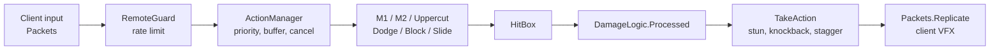
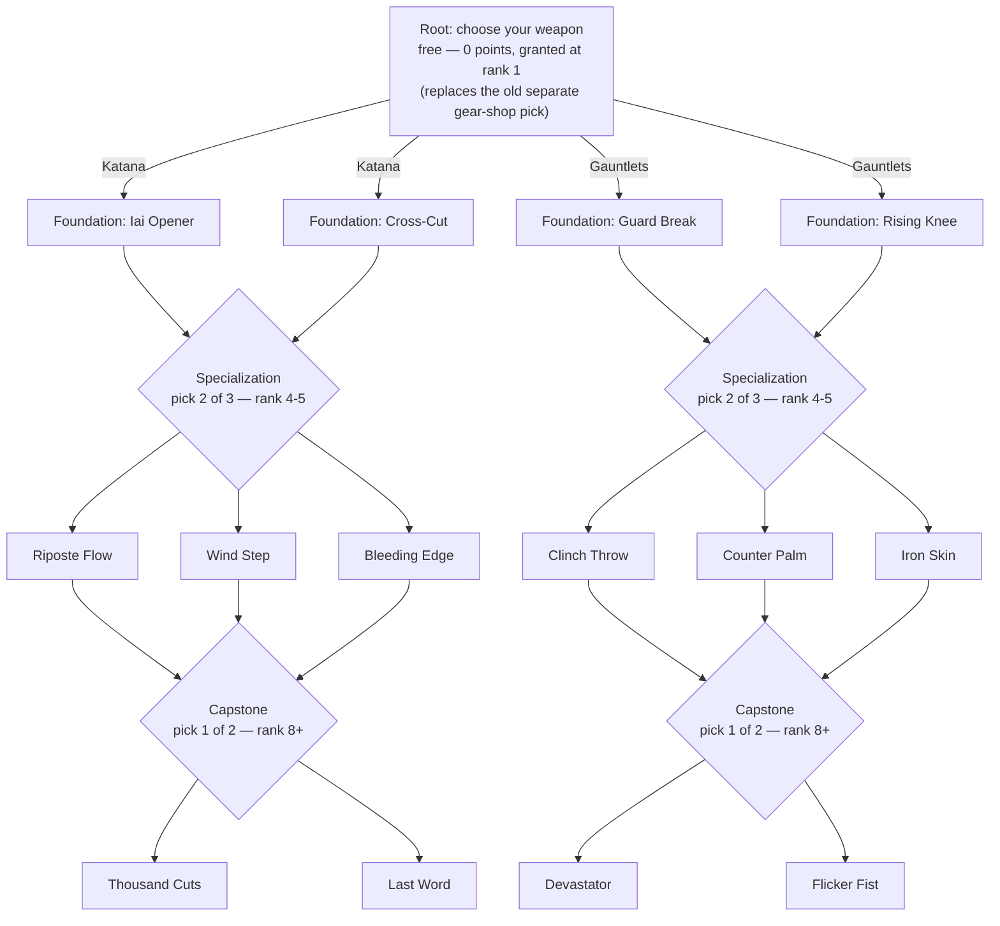

# Game C — Merger Audit & Design

2026-09-24 · Jay · Live version: the "Game C — Merger Audit & Design" Claude Doc. This file is a snapshot of it.

## Overview

This doc audits two Roblox codebases and will turn them into one design, Game C. It covers phases 1–2 (audit and comparison) first, then the interview, then the design.

**Ready to start building?** See [`game-c-build-list.md`](game-c-build-list.md) — everything
below reorganized around what can be prototyped in a fresh baseplate right now, with a
suggested build order.

| | Game A | Game B |
| --- | --- | --- |
| Studio place | "Map + Combat" (placeId 87872916277829) | "animation farm" (placeId 72078340292677) → `ServerStorage.CC` |
| Theme | Dorohedoro-inspired (your project) | Bleach-inspired (packed game, `v_Aug_17`, package README dated 3/27/2024) |
| Live source | ~340k lines (includes ~8 MB vendored ReactLua) | ~32 MB of source in 1,899 scripts |
| State | Active development, backups dated 2026-09-23/24 | Complete packaged game, unpacks on load |

**Method:** scripts were read directly from Studio through the MCP bridge. Vendored libraries (React, Packages, Cmdr) are noted but not audited line by line. Backup and archive folders are skipped unless live code depends on them.

**Status:** Phases 1–2 done, interview complete (29 rounds, 120 questions), Game C design
drafted and updated through rounds 24–29's reconsideration of where Game B's approach — not
code — should lead instead of just filling gaps in Game A's, including systems the original
comparison table had simply marked "Keep A" with no pushback, a previously-undefined gap in
what a weapon's actual moveset is (now one tree rooted at the weapon choice), the visual
target for both hubs (see [`art-direction/`](../art-direction/)), and Blue Night's split into a
Sorcerer World carnival/contract event and the Hole's renamed Night of the Living Dead.
Everything in the design
section is either a direct interview
answer or a **[draft]** value proposed for Jay to tune from
playtesting — nothing is final until he says so.

## Game A — "The Hole" (Map + Combat)

Game A is an open-city Smoke-sorcerer brawler. Its combat and back end are deep, but its progression and endgame are thin. The strongest code is in combat (ActionManager → DamageLogic), and the world runs on about 50 small data-driven services. It began as a JJK base kit (`ProgressionConfig` still names "jjk's leftover" systems), and most of that kit has since been replaced.

### Core gameplay loop

Spawn in the Hole → walk or Smoke-door to a quest giver or job board → fight zombies, thieves or militia, or run errands → earn Yen and Burial Tags → buy food buffs and gear → random world events every 4–8 minutes pull players together (Blue Night, Field Boss, Killing Field) → PvP kills fill the server-wide War meter → at 100 a Riot doubles rewards and pays for kills.

### Progression

| Track | How it grows | Cap | What it gives |
| --- | --- | --- | --- |
| Level (derived from XP) | 40 XP per PvP kill, 60 per quest turn-in | 50 (32,340 XP) | Title + 1 attribute point per level |
| Attributes (T menu) | Points from levels, quests and the Grave Keeper (10 tags each) | 20 ranks × 4 (Smoke, Strength, Toughness, Vitality) | Rank 20 ≈ +70% of that stat. Respec: first free, then ¥250 with a 10-minute cooldown |
| Use-based stats (P-06) | Training at the Fight Club, or use; hourly caps | 50 | Only Endurance does anything (+3 HP per level). Weapon and Durability are saved but unused |
| Smoke type | Rolled once, weighted: Split 20, Gun 20, Regen 18, Mushroom 18, Curse 12, Lizard 8, Dinosaur 4 | — | 2–3 moves on Z/X/C. No reroll |
| Quirks | Rolled once: 1 good + 1 bad | — | ±5–15% to HP, Smoke, speed, damage; food-related quirks |
| Gear | Bought: 6 weapons, 6 equipment pieces, 1 quest mask | — | Flat ±5–20% modifiers |
| Gang rep | Killing Ashmask raiders | 100, decays 5/day after 24 h | Unlocks gang dialogue (10) and premium shop rows (30) |

At 100 XP per quest, level 50 takes about 540 quest completions. Maxing all attributes needs 80 points, but levels give only 49. The gap is filled with tag purchases, which makes Burial Tags the real long-term currency.

### Combat

The server is authoritative. The client sends input packets (buffer-encoded `Packet` library), the server runs action modules, and state is replicated back as VFX events.

Every hit passes through `DamageLogic.Processed`, which checks these in order: safe zone → spawn grace → 45-stud reach check → speed-hack check → multiplier stack → i-frames (perfect dodge) → parry → ragdoll → block and posture → stagger gain → world hooks.

- **M1:** 4–5 hit combos per weapon, plus running and aerial variants. Air combat has an air-weld juggle and a downslam finisher.
- **M2 (heavy):** separate module per weapon. A landed M2 silences Smoke users for 2.5 s.
- **Block, parry and posture:** block opens with a 0.25 s parry window. A clean parry gives the defender a 1 s Riposte (+25% damage). Blocked hits add posture (damage × 1.7) and deal 15% chip damage. At 100 posture the guard breaks and the player is Paralyzed. Posture drains after 2 s without a hit.
- **Stagger meter:** built only by skilled play (being parried +40, eating a counter +30, unblocked heavy +20, being interrupted +12). At 100 it opens a Finisher window: the next M2 deals ×1.5.
- **Dodge:** has i-frames. A perfect dodge (hit lands inside the i-frames) resets the Dodge cooldown and makes the next hit ×1.3.
- **Feint:** cancels an M1 into a feint on a 3 s cooldown.
- **Input buffer:** 0.6 s. Dodge and Block may cancel an attack's recovery, but only after its hitbox has fired.
- **Smoke moves:** cost Smoke from a flat 200 bar. Landed M1s refund 1.5% of the bar. Types range from DoT (Curse) and traps (Mushroom) to transformation forms (Lizard, Dinosaur).
- **Weapons:** Katana, Fist, Axe, Trident, Dagger, Sword and SwordShield. Only Katana and Fist have published animations; the other five use `rbxassetid://0`, borrowed Fist clips or placeholders.

### Character development

There is one origin, Sorcerer. Human is coded, but its roll chance is 0. The build space is: Smoke type (random) × weapon × attribute spread × 3 gear slots × quirks. Vows (Fists, Flames) exist as modules but are switched off. A Devil Awakening trial is scaffolded in 4 stages with fail-on-death, but its content is still TODO.

### Content

| Type | What exists |
| --- | --- |
| Map | Hole city: Shibuya-style streets, SecondWard, Brick Estate, Lab, Warehouse, Food Alley. 29 POIs, 3 danger zones (Kanon Park D1, Old Town Backstreets D2, Port Island D3), 3 secrets, 2 safe zones (The Diner, Hell), 34 event spots |
| Second place | Zogan's Academy Grounds, a separate place used by the tutorial questline |
| NPCs | 15 dialogue NPCs: Liaison, Madame Ise, the Grave Keeper, the arms dealer, 4 food-alley vendors, the Trainer, Dr. Mizoguchi and others |
| Quests | 28: a 9-step Enrollment chain, a 4-step Advanced chain and 15 repeatables (cooldowns of 8–30 minutes) |
| Events | 12 random events: Smoke Surge, Supply Cache, Whisper, Toxic Rain, Blue Night, Cleanup Day, Ghost Night, Rule of the Hour, Party Mishap, Killing Field, Ashmask Sweep, Field Boss (The Skinner) |
| Enemies | Zombie, Specimen, Night Stalker, Thief, Ashmask grunt and captain, Proctor Dunmore (420 HP), The Skinner (800 HP, scales with players). Archetypes: Shield, Rusher, Thrower, Flanker |
| Exploration | 7 Smoke doors (toll fast travel), 8 hidden Hell entrances (the reward for finding all is the Devil's Mask), Grudge Monument, rumor board, discovery toasts |

### Economy

- **Currencies:** Yen and Burial Tags. Tags cash out at ¥30–35 each and also buy attribute points.
- **Faucets:** quests (¥40–300), jobs (¥80 + 2 tags), events (¥15–150), Riot kills (¥25), Killing Field kills (¥20).
- **Sinks:** food buffs (¥35–250), gear (¥250–500 each, about ¥4,300 for everything), door tolls (¥30/60), respec (¥250), Black Smoke (¥120).
- **Guardrails:** Yen can't go negative or fractional, save data is sanitised on load, and every change is logged to `EconomyLog` and Roblox Analytics.
- **No trading.**

### PvP

PvP is open everywhere except safe zones. PvP kills give XP (40), Elo rating (K = 24, with a leaderboard), War meter progress and bonus Yen during a Riot or Killing Field. Party members can still hit each other; there is no friendly-fire rule.

### PvE

PvE comes from quest mobs, job-board zombie hunts, events and one field boss. The AI stack is solid: NPCController (37k chars), a swarm token system (only N attackers at once), navigation, ranged throwers and archetypes. Mobs and bosses gain +35% health and damage per extra nearby player, capped at ×2.5. BossService supports phases at health thresholds.

### Death

There is almost no penalty: a 3 s respawn followed by 3 s of spawn grace. Nothing is lost — no items, Yen or XP. The only death rules are that Hex hits harder if the caster dies and that dying mid-trial resets the Devil Trial.

### Endgame

There effectively isn't one. The reachable goals are level 50, 80 attribute ranks, Elo ladder rank, all Hell entrances and the Devil Trial (unfinished).

### Social

- **Parties:** in-server only, via chat commands and a React panel.
- **Clans:** saved in a DataStore. Created with chat commands and not race-safe. They have no gameplay effect.
- **Contracts:** Blue Night partner contracts record a pair but have no effect yet.
- **Leaderboards:** QuestsDone, BurialTags and Rating.

### Technical architecture

- **Two layers:** a Services layer (inherited kit: ActionManager, EntityLoader, AI, Data) and a World layer. The World layer is about 50 Scripts and Modules that talk through `ServerStorage.WorldSignals` Bindables and player attributes.
- **Data:** ProfileService with session locking, versioned migrations and a sanitiser. One store, `PlayerData_v1`, is shared across places.
- **Networking:** buffer packets for combat and plain Remotes for the World layer, rate-limited by `RemoteGuard` (token buckets, kick on abuse).
- **UI:** mixed. A React HUD (`ReactHudClient`, HudUI widgets), older ScreenGui scripts, and leftovers from the kit.
- **Tooling:** Cmdr admin commands and a 36k-char `SelfTest` harness for Studio.
- **Dead code:** `StarterGui.SkillTree` (Portuguese, needs a missing `Modules.SkillsReqs`), the `PurchaseSkill` and `DevProductNotif` remotes, a disabled Ghoul/CCG ProgressionService, and 7 dated backup folders in ServerStorage.

### Strengths

1. The combat has real depth: parry → riposte, perfect dodge → counter, stagger → finisher, posture, feints, air juggles and an input buffer. Skill wins fights.
2. It is secure by default: every remote is rate-limited, hits are checked for reach and speed server-side, and actions are allowlisted.
3. The world has personality. Events like Rule of the Hour, Ghost Night and Blue Night, plus hidden Hell entrances and the Grudge Monument, make the city feel alive.
4. The code is data-driven. Quests, events, shops, Smoke moves and archetypes are config tables, so content is cheap to add.
5. The save layer is production quality: ProfileService, migrations, sanitising and an economy log.

### Weaknesses

1. **No stakes.** Free death, no loot drops and no item loss mean PvP has no tension beyond Elo.
2. **Thin power curve.** Level 50 takes about 540 quests, but each level only gives 1 point and a title. The numbers are small, and the gear ceiling is reached in a few hours.
3. **Economy dead-ends.** Once the 12 gear items are bought, Yen only goes to food and tolls.
4. **One-shot randomness with no path forward.** Smoke type and quirks roll once, with no reroll or pity. A 4% Dinosaur roll is permanent.
5. **Stubbed systems.** Contracts, Devil Trial stages, clans and Vows exist but do nothing yet.
6. **Content is placeholder.** Five of seven weapons have no animations, and equipment uses part-built visuals.
7. **Hard to keep consistent.** There are about 50 services and several UI generations, and many systems communicate only through attributes.

## Game B — Soul-realm faction MMO (CC package)

Game B is a large Bleach-style faction MMO. Its biggest draws are **race transformation** and a **social hierarchy**. It gets there with heavy RNG, long timers and code that can't be maintained.

**Provenance: read this first.** Dozens of scripts carry the header `Saved by UniversalSynSaveInstance (Join to Copy Games)`, and much of the code is decompiled output (`v0`, `v1`… variable names). This package was ripped from someone else's live game with an exploit tool. Place names, the `TYPETEST` flags and the database name point to the Type://Soul family of games. None of its code, models, animations, VFX or maps can ship in a game you publish. **Game B is a design reference only.**

**Security findings (do not bring these files into Game A):**

- **Bytecode VM:** `NPCBoss.Data.Main` contains `FiOne`, a Lua bytecode interpreter that runs code through `setfenv`. That is the standard way to hide a backdoor.
- **Asset loading:** the `Shinigami` state machine pulls in `InsertService`.
- **Live secrets:** Discord webhook URLs are hard-coded in `Webhooks` and `FactionManager`. They are left out of this doc on purpose.
- **Outbound calls:** `Teleports` calls an external IP-geolocation API, and `FirebaseService` posts to an outside database.
- **Game A is clean.** A scan of the "Map + Combat" place found none of these markers.

### Core gameplay loop

Spawn as a Lost Soul → pick a path (Shinigami, Hollow, later Quincy) → grind EXP on NPCs, missions and PvP → rank up through grades (each rank has an EXP target, a minimum time at rank and, at higher ranks, PvP "grips") → unlock a release (Shikai, Res or Vollstandig) → join a faction's division and raids → chase Bankai or its equivalent and rare rolls.

### Progression

| Track | How it works |
| --- | --- |
| Race path | Lost Soul → Shinigami or Hollow. Hollows evolve Frisker → Fishbone → Menos → Adjuchas → Vasto Lorde, dying and respawning at each stage. Late hybrids: Arrancar, Vastocar, Visored. Quincy is its own faction |
| Rank grades | 14 grades from Trainee through Grade 5–1 and Special Grade to Semi-Elite and Elite. Each needs 20 EXP (×4 multiplier, ×0.7 for Shinigami) plus a minimum time at rank. Top ranks also need PvP grips, raid grips and division EXP |
| Shikai personality | Rolled: Kind Hearted, Squeamish, Vengeful, Hateful, Chaotic or Pure. Decides which activities feed release EXP (Hateful needs grips; Pure needs Hollow kills) |
| Stats | SP spent on Hakuda, Kendo, Kido, Speed, Healing and Bladedancer. Each scales a different system (Kendo scales posture damage; Speed scales flashstep) |
| Skills | Unlocked by SP thresholds, skill boxes (loot) and essences. There are 366 server skill modules |
| Releases | Rolled from rarity pools: common, rare, legendary, mythical (about 30 Shikai, 23 Res, 17 Vollstandig). Bankai needs a fight, time at rank and kill counts. True Bankai has a 12-hour cooldown |
| Identity rolls | Weapon type (1% rare), zanpakuto name and callout (10% rare), hilt and colours, eyes, 10% marking chance, clan (common, then legendary 3%, mythical 1%, "Hell" 0.5%) |
| Rerolls | Items, capped at 500–1,500 per type, sold through developer products |

### Combat

Combat runs on a state machine per entity type. Its core pieces:

- **Light attacks and posture:** block adds posture (base 50, scaled by Kendo). A posture break opens the defender up.
- **Deflect:** parrying stuns the attacker for `ParryStunTime`. There is a 0.4 s auto-parry frame.
- **Other defence:** counters on a 20 s cooldown, hyperarmor, and weapon clashes (`ClashSystem`).
- **Movement and pressure:** flashstep scales with Speed, and critical strikes are tied to the release.
- **Artifacts:** they change the defensive rules, for example extra block chip, a parry that absorbs Reiatsu, or reduced posture damage.
- **Resources:** skills cost Reiatsu. Releases add meter modes with regen buffs (Res +30%, Vollstandig +35%).

### Content

- **Places:** 9+ places — Main Menu, Karakura Town (shared hub), Soul Society, Rukon District, Hueco Mundo, Las Noches, Wandenreich City, a Clan War lobby and the Dangai travel corridor. Gates (Senkaimon, Garganta) can be broken, with 45 s cooldowns.
- **Enemies:** about 50 NPC and boss state machines: Lost Soul, Frisker, Fishbone, Menos, Adjuchas, Vasto Lorde, Jidanbo, Nozarashi, Visored, and more than 30 named bosses.
- **Activities:** boss raids with voting, party missions through queues (rank-gated), bounty board, Stalker missions, a timed AFK world, codes and weekend loot events.
- **Game modes:** Gladiator (lives), Art of Soul, King's Gambit, Soul Shuffle, Clan War, Championship and ranked arena.

### Economy

- **Currency:** Kan.
- **Items:** over 500 tradeables across accessories (10 slots), items, artifacts and clan items. Rarity counts: Common 16, Uncommon 5, Rare 20, Legendary 79, Mythical 103, Limited 12, plus 150 marked Unobtainable (developer-only).
- **Prices:** sell values from 150 (Common) to 4,000 (Legendary). Legendary accessories cost 40,000.
- **Faucets:** world lootboxes, raids, missions and codes, plus weekend multipliers of ×10 and ×20.
- **Trading:** full player trading (`TradeManager`).
- **Monetization:** developer products for rerolls and boxes, with a purchase-history receipt ledger.

### PvP

Full-loot-lite PvP built on **knock → carry → grip (execute)**. At 0 HP a player is knocked out for 12 s. The attacker can carry them, execute them (which counts toward rank-up) or let them get up. A 60 s combat tag punishes logging out mid-fight. Bounties go on repeat killers, jail has bail, and ranked Elo has a soft cap. Faction wars include Karakura raids, invasions, Quincy hunts, capture items and flags.

### PvE

The AI is state-machine driven. Each boss is a separate 170k-character copy of the same template, about 8 MB in total. Raids track damage contribution, scale respawn timers (30 s, +10 per death) and grant faction-wide raid buffs.

### Death

Death has real stakes:

- **Base respawn:** 3 s. In raids it is 30 s (+10 per death); in hunts it is 60 s (+30 per death).
- **Executions:** being gripped counts for the killer's progression.
- **Losses:** Hollows lose 5 of the 18 mask cracks they need. Release EXP can drop 10%. Held capture items, flags and dropped items fall to the ground, and Kan can be dropped.
- **Combat logging:** leaving mid-fight is recorded against the player.

### Endgame

Top division positions (Captain, Espada, Sternritter, King), True Bankai and the late forms, the ranked ladder and championship titles, mythical rolls, clan wars and rare cosmetics.

### Social

- **Factions:** Shinigami, Arrancar and Quincy.
- **Divisions:** 13 squads with ranked positions.
- **Clans:** DataStore rosters and clan wars.
- **Other:** parties with a mission queue, trading, titles, and cross-server messaging for admin actions.

### Technical architecture

- **Server layout:** Managers (Data, Faction, Division, Rank, Combat, Trade, AntiCheat) plus `EntityStateMachines`. The `Shinigami` state machine alone is 841k characters.
- **Client layout:** skill, release and VFX modules, about 5.4 MB.
- **Data:** ProfileService with rollback and version queries. Admin IDs are hard-coded.
- **Anti-cheat:** position, flight and noclip checks, remote history, and auto-ban on malformed input.
- **Duplication:** 7+ OLD or BACKUP copies of live managers. `FactionManager` has three near-identical variants of about 300k characters each.

### Strengths

1. **Transformation fantasy.** Evolving from Lost Soul to Hollow to Vasto Lorde, or Shinigami to Bankai, gives obvious, visible power spikes to chase.
2. **Personality-gated progression.** The same goal is reached through different activities, which nudges players into different playstyles.
3. **Knock → grip → execute.** Kills are a choice with consequences: mercy, execution, bounties, jail.
4. **Social hierarchy.** Division seats, faction raids and clan wars give players status to fight over.
5. **Distinct realms.** Each realm has its own identity, and travel between them (Dangai, gates) feels like a journey.

### Weaknesses

1. **Gacha everywhere.** Identity, weapon, release and clan are rolls; rerolls are paid; mythical pools and developer-only items exist. That creates pay-to-win pressure and frustrates players who roll badly.
2. **Time gates.** Minimum time per rank, a 12-hour True Bankai cooldown and AFK worlds stretch play instead of deepening it.
3. **Forced PvP.** Rank-ups need player grips, which locks PvE-focused players out.
4. **Inflation.** Weekend ×10 to ×20 multipliers and code handouts devalue the loot chase.
5. **Overwhelming for new players.** Nine places, six stats, dozens of forms and more than eight game modes.
6. **Code can't be maintained.** It is copy-paste bosses, decompiled output, hard-coded secrets and a probable backdoor, on top of the IP problem.

## System-by-system comparison

Game A supplies the engine: combat, data, world services and security. Game B supplies ideas for stakes, identity and long-term goals. Every B concept is rebuilt inside A's code. These verdicts are provisional until the interview confirms direction.

| System | Game A | Game B | Verdict | Why |
| --- | --- | --- | --- | --- |
| Combat | ActionManager + DamageLogic, server-authoritative | Per-entity state machines, deflect, counter, clash | **Keep A**, merge clash and hyperarmor | A is cleaner and already secured; clash and hyperarmor fill gaps for bosses and heavies |
| Movement | Sprint, slide, dodge, aerial, feint | Flashstep scaled by the Speed stat | **Keep A**, add mobility as a build option | A's feel is tuned; B's idea of a stat that shapes mobility adds build variety |
| Blocking | Posture 0–100, 15% chip, drains after 2 s | Posture scaled by Kendo, artifact modifiers | **Keep A** | Expose posture multipliers as stat and gear hooks |
| Parrying | 0.25 s window → Riposte, auto-parry follow-up | Deflect + parry stun, counter on a 20 s cooldown | **Keep A** | A already rewards the parry with Riposte and stagger |
| Dodging | I-frames, perfect dodge → counter | Flashstep only | **Keep A** | B has no equivalent |
| Abilities | Smoke type (2–3 moves), rolled once | 366 skills, releases rolled from rarity pools | **Rebuild** | Keep A's type identity; add earned unlocks and staged releases instead of one roll |
| Weapons | 7 buyable; 5 have no animations | Rolled weapon type with rarity | **Keep A** | Weapons are bought or earned, never rolled; the gap is animation work |
| Classes | None | Class field (9 modules) | **Remove** | Smoke type and weapon already define a role; a class would overlap |
| Races | Sorcerer only (Human coded at 0%) | Lost Soul → branching races and evolutions | **Merge** | A already has Human, Sorcerer and a Devil trial scaffold; B's transformation arc makes them a path |
| Stats | 4 attributes + 3 unused use-stats | 6 SP stats, each scaling a system | **Rebuild** | One stat system; drop the unused use-stats; each stat should change how you play, not just a number |
| Leveling | Level 1–50 from quest and PvP XP | Rank grades with EXP + time + grips | **Rebuild** | Named ranks with activity requirements, no wall-clock timers |
| Talents | Quirks (random good + bad) | Shikai personality gates EXP sources | **Merge** | Quirks become "temperament": it picks which activities speed your growth, not a flat stat |
| Skills | Smoke moves only | Skill boxes, SP-threshold trees | **Rebuild** | A small earned skill pool per Smoke type |
| Quests | 28 data-driven, 7 step types | Queue missions with rank gates | **Keep A** | A's quest engine is better; add rank gates |
| NPCs | 15 dialogue NPCs, actions, rep gates | Large NPC handler | **Keep A** | A's dialogue system is data-driven |
| Bosses | Proctor, The Skinner; BossService phases | 30+ copy-pasted bosses | **Keep A** framework | Add bosses as config + phase functions, never copies |
| Dungeons | None | Boss raids with voting, hunts | **New** (B-inspired) | Build on A's Survive/Kill steps, Mobs and BossService |
| World | One city + Academy place | 9+ realm places with gates | **Keep A**, grow slowly | One dense city plus a few gated places, not nine |
| Exploration | Doors, Hell entrances, secrets, rumors | Realm gates, Dangai | **Keep A** | A's discovery loop is its best non-combat feature |
| Loot | Mobs drop nothing | Lootboxes, rarity tiers | **New** | Game C needs drop tables |
| Inventory | 4 slots + consumables | 10 accessory slots + hotbar | **Keep A**, expand | 5–6 slots is enough |
| Economy | Yen + Burial Tags | Kan + rarity + paid rerolls | **Keep A** currencies, add sinks | No paid rerolls of power |
| Trading | None | Full trading | **Rebuild later** | Only once the loot table exists, with anti-dupe on UpdateAsync |
| Death | Nothing lost | Knock → carry → grip, drops, losses | **Merge** | A needs stakes; B's knock-down gives choice instead of instant loss |
| Respawning | 3 s + 3 s grace | 3 / 30 / 60 s, scaling per death | **Keep A**, add scaling in raids | |
| PvP | Open, Elo, War meter, Riots | Faction wars, bounties, jail | **Merge** | A's War meter plus B's bounty and jail give PvP consequences |
| PvE | Events, jobs, one field boss | Raids, hunts, bosses | **Keep A** + raids | |
| Factions | En's Gang rep (1 gang) | 3 factions with division seats | **Merge** | A's gang rep becomes factions with ranks and seats |
| Guilds | Clans (no effect, race-unsafe) | Clans + clan wars | **Rebuild** | After factions; decide whether clans or factions are the social unit |
| Parties | In-server, React panel | Parties + mission queue | **Keep A** | Add party-based credit sharing |
| Events | 12 random world events | Weekend loot ×10–×20, raids | **Keep A** | Drop reward multipliers — they inflate the economy |
| Crafting | None | Essences (partial) | **Optional** | Only if loot needs a second sink |
| Shops | 8 shops, rep-gated rows | Market rotation | **Keep A** | Add rotation later |
| Progression | Thin (1 point per level) | Deep but time-gated | **Rebuild** | The core problem to solve in Game C |
| Endgame | None | Seats, True Bankai, ranked, mythic rolls | **New** (B-inspired) | Seats + late transformations + ranked |
| UI | React HUD + legacy ScreenGuis | Many ScreenGuis | **Keep A** React HUD | Remove legacy UI |
| Data saving | ProfileService + migrations + sanitiser | ProfileService + rollback | **Keep A** | Add a rollback admin command (concept only) |
| Anti-exploit | RemoteGuard, reach/speed checks | Movement, flight and noclip checks | **Keep A** + movement checks | |

## Code triage

Only Game A's code is a candidate for reuse, and most of it is. Game B contributes design concepts, which get reimplemented from scratch in A's architecture.

### Reusable (Game A, keep as-is or with light edits)

| System | Main scripts | Depends on | Why keep |
| --- | --- | --- | --- |
| Combat core | `Services.Player.ActionManager` + action modules, `ServerStorage.Packages.DamageLogic`, `HitBox`, `AirCombat` | StateManager, TagService, TrackService, Packets, EntityLoader, RemoteGuard | Deep, tuned, server-authoritative, with reach and speed checks |
| Networking | `Remotes.Packets` / `UnPackets`, `World.RemoteGuard` | Packet library (buffers) | Compact, rate-limited, allowlisted actions |
| Save layer | `Services.Player.Data`, `World.DataMigrations`, `EconomyLog`, `DataStoreRetry` | ProfileService | Session locking, versioned migrations, sanitiser, analytics |
| AI | `Services.AI.AI` (NPCController, Swarm, Navigation, Ranged), `Config.NPCArchetypes` | ActionManager, DamageLogic, SimplePath | Archetypes and attack tokens make readable PvE |
| Mobs and bosses | `World.Mobs`, `MobScaling`, `BossService` | AI | Spawn, scale and phase from config |
| Quests | `World.QuestService`, `World.Quests` | WorldSignals, Mobs, NPCService | 7 step types, cross-place, repeatables |
| World layer | `WorldService`, `WorldQuery`, `POIIndexService`, `DoorService`, `HellService`, `RumorService`, `EventService` | WorldMarkers, CollectionService tags | Discovery and events are A's identity |
| NPCs and shops | `NPCService`, `Dialogues`, `EconomyService`, `Shops` | Guard, Reputation | Data-driven dialogue, rep gates |
| Items and buffs | `InventoryService`, `Items`, `Buffs` | Attributes read by DamageLogic | Simple and working |
| Ops | `ModerationService`, `SettingsService`, Cmdr, `SelfTest` | DataStoreRetry | Bans, per-player settings, admin commands, test harness |
| UI | `ReactHudClient`, `HudUI` | ReactLua | Newest UI generation; standardise on it |

### Rebuild (keep the concept, rewrite the code)

| System | Problem | Rebuild as |
| --- | --- | --- |
| `ProgressionService` + `ProgressionConfig` | 50 levels that each give only 1 point | Named ranks with activity requirements (B's grades, without timers) |
| `Stats` + `StatConfig` | Weapon and Durability XP are saved but do nothing | Fold into one stat system, or delete |
| `SmokeMoveService` roll | One permanent roll, no path forward | Rolled starting type + earned unlocks, a pity or reroll quest, staged forms |
| `ClanService` | Chat commands only; get-then-set races on the roster | UpdateAsync roster with React UI, after the faction decision |
| `Contracts` / `DevilTrial` | Scaffolding with no effect or content | Real stages hooked into the transformation path |
| Weapons 3–7 | `rbxassetid://0`, borrowed Fist clips | Animate or cut; ship 3–4 finished weapons rather than 7 half-done |

### Remove

- `StarterGui.SkillTree` (dead JJK kit UI, needs a missing `Modules.SkillsReqs`) and the `PurchaseSkill` and `DevProductNotif` remotes.
- The disabled Ghoul/CCG ProgressionService and the legacy `TumorGrade` save field (by migration).
- Seven `Backup_*` / `Archive_*` folders in ServerStorage. Move them to a local file, because they bloat the place and confuse search.
- About 90 loose parts and models in the root of `Workspace.Map`. Move them into region folders.

### Merge (Game B concept → Game A code)

| Concept from B | Where it lands in A |
| --- | --- |
| Knock → carry → grip (execute) | New `Downed` state in StateManager; a DamageLogic.TakeAction hook replaces instant death in PvP |
| Personality-gated growth | QuirkService → temperament; ProgressionService reads which activity feeds rank EXP |
| Staged transformations | SmokeMoveService forms + the DevilTrial pipeline |
| Faction seats | Reputation module generalised to several factions; seats as a ranked list per faction |
| Bounty and jail | WarService + WorldSignals.PlayerKilled |
| Raid contribution credit | Mobs `CreditRange` → damage-share tracking in BossService |
| Clash and hyperarmor | DamageLogic.Processed (hyperarmor = ignore stun) and a clash branch when two M2s meet |

### Optional (later, not in the first build)

Trading, crafting and essences, arena game modes (Gladiator, King's Gambit), ranked seasons, and more realm places.

### Game B migration verdict

**Nothing moves.** Every B system above is rebuilt from its idea, not its code. There are three reasons:

1. **Ownership:** B was ripped from another developer's game.
2. **Safety:** it contains a bytecode VM and live secrets.
3. **Maintainability:** decompiled, copy-pasted code can't be maintained.

Keep the `animation farm` place away from your published place, and never paste CC scripts or models into it.

## Interview log

Round 1 covers the decisions everything else depends on. Answers get recorded here as they come in; the newest answer wins if two conflict.

### Round 1 — identity and stakes (asked 2026-09-24)

| # | Question | Answer |
| --- | --- | --- |
| 1 | PvP, PvE or a mix — and where is PvP allowed? | **Mixed, zoned.** PvE progression everywhere. PvP is open in danger zones and during events (Riot, Killing Field). Safe zones stay safe. |
| 2 | What should death cost? | **Knock-down + soft loss.** At 0 HP you are downed; the attacker can spare, carry or execute. An execution drops a share of carried Yen and Tags. Gear and progression are never lost. |
| 3 | How is a character's power identity decided? | **Rolled and permanent.** Smoke type stays a one-time roll. Rerolls exist only as rare drops, so the roll is a long-term chase. |
| 4 | What goes in the public GitHub repo? | **Everything**, including the provenance and security sections. |

### Round 2 — world, progression, endgame, combat balance (asked 2026-09-24)

| # | Question | Answer |
| --- | --- | --- |
| 5 | How big is the world at launch? | **Hole + Sorcerer World.** Two main hubs from day one, linked by Smoke doors. |
| 6 | What shape does long-term progression take? | **Named ranks.** About 10 ranks, each unlocked by a mix of activities, no wall-clock timers, a visible reward per rank. |
| 7 | What is the late-game power fantasy? | **Devil path.** Finishing the Devil Awakening trial transforms you into a devil: rare, hard, lost on death mid-trial. |
| 8 | Weapon vs Smoke power? | **Equal partners.** Weapons carry melee; Smoke gives 2–3 signature moves. A weak roll stays viable through weapon mastery. |

**Tension to resolve in round 3:** a permanent Smoke roll (answer 3) plus equal weapon power (answer 8) means weapon mastery has to be deep enough to carry a player with a weak roll.

### Round 3 — combat (asked 2026-09-24)

| # | Question | Answer |
| --- | --- | --- |
| 9 | How much of Game A's combat kit stays? | **All of it:** parry → riposte, perfect dodge → counter, stagger → finisher, feints and air juggles. |
| 10 | Add Game B's hyperarmor and clashes? | **Hyperarmor for bosses and heavies only.** Certain boss swings and slow-weapon attacks (Axe) can't be flinched. No clashes. |
| 11 | Keep the 2.5 s Smoke silence on a landed M2? | **Keep 2.5 s.** It is melee's main answer to Smoke-heavy players. |
| 12 | Should mobility vary between builds? | **Through Smoke and gear, not a stat.** Everyone shares the same base movement; some Smoke types or gear add mobility. |

### Round 4 — weapons and Smoke (asked 2026-09-24)

| # | Question | Answer |
| --- | --- | --- |
| 13 | Which weapons ship at launch? | **Katana + Fist only.** More come in later updates. |
| 14 | How does weapon mastery work? | **No mastery.** Weapons are equal from the start; only player skill matters. |
| 15 | How are Smoke moves obtained? | **All at once.** Every move of your type from the start, as in Game A now. |
| 16 | Are rarer Smoke types stronger? | **Rarer = flashier, not stronger.** Keep the roll odds, but balance every type to be equally viable. |

**Resolved:** balancing every type equally (16) takes care of the weak-roll tension from round 2, so mastery isn't needed.

**New tension:** named ranks need a visible reward per rank (6), but moves come all at once (15) and there is no mastery (14). Rank rewards will have to come from somewhere else, such as gear slots, Smoke capacity, access to areas, titles and cosmetics, or Devil-trial eligibility.

### Round 5 — character development (asked 2026-09-24)

| # | Question | Answer |
| --- | --- | --- |
| 17 | Which origins exist? | **Sorcerer only, for now.** Other starting origins may come later, such as a lesser devil or other Dorohedoro-based starts. |
| 18 | Keep the 4 attributes? | **Keep, but lower the ceiling** from about +70% to about +30% at max, so skill matters more than grind. |
| 19 | What happens to quirks? | **Turn into temperament.** Like Game B's personalities: the roll decides which activities speed your rank-ups. |
| 20 | What happens to Vows? | **Remove** the Vow code. |

### Round 6 — progression and ranks (asked 2026-09-24)

| # | Question | Answer |
| --- | --- | --- |
| 21 | Where do attribute points come from? | **Rank-ups.** Each rank grants a batch of points, which also gives every rank a visible reward (resolves the round 4 tension). |
| 22 | What do rank-ups require? | **PvP required at high ranks.** Like Game B's grips, the top ranks need executions or wins in PvP zones. |
| 23 | How does temperament affect progression? | **Bonus, not a lock.** Every activity counts; your temperament's favorite activities give extra rank progress. |
| 24 | How long to max rank? | **About 40–60 hours** for an average player. |

**Note:** PvP is only allowed in danger zones and events (answer 1), so high-rank players must enter them. That makes the danger zones the endgame arena. The design must stop farming friends for executions: no credit for repeat kills on the same victim, and a victim-rank floor.

### Round 7 — content (asked 2026-09-24)

| # | Question | Answer |
| --- | --- | --- |
| 25 | Where does the Academy live? | **Inside Sorcerer World.** The tutorial happens in the Academy district, then players take a door to the Hole. |
| 26 | Dungeons? | **None.** Events and field bosses carry group PvE. |
| 27 | Boss types at launch? | **Field + dungeon + story.** With no dungeons (26), this is read as **field bosses + story bosses**. |
| 28 | Quest balance? | **Mostly repeatables.** Boards, jobs and events, with minimal story. |

### Round 8 — world (asked 2026-09-24)

| # | Question | Answer |
| --- | --- | --- |
| 29 | Bosses: which did you mean? | **Field + story bosses only.** No dungeons (confirms 26 and 27). |
| 30 | What happens to the 12 world events? | **Keep the best, cut the rest** (about 6). Which ones is asked in round 9. |
| 31 | How does travel work across two hubs? | **Walk only inside hubs.** Doors only link the Hole and Sorcerer World; no teleporting within a hub. |
| 32 | What is Hell for? | **Its own separate place later**, like Sorcerer World. Hell is not needed for the Devil progression. |

**Knock-on effects:**

- Removing in-hub toll doors removes a Yen sink (¥30/60 per trip), so the economy needs a replacement.
- The 8 hidden Hell entrances and the Devil's Mask reward lose their purpose until the Hell place exists. They can stay as a hidden collectible or be switched off until then.

### Round 9 — events and Hell entrances (asked 2026-09-24)

| # | Question | Answer |
| --- | --- | --- |
| 33 | Big events kept | **Blue Night** only. Field Boss, Killing Field and Ashmask Sweep are cut. |
| 34 | Strange events kept | **Toxic Rain** only. Ghost Night, Rule of the Hour and Party Mishap are cut. |
| 35 | Small events kept | **None.** Smoke Surge, Supply Cache, Whisper and Cleanup Day are cut. |
| 36 | Hell entrances and the Devil's Mask | **Remove.** Hell's entrances will be designed fresh with the Hell place. |

**Knock-on effects:**

- **Field bosses (29):** the only field boss today spawns through the Field Boss event. Field bosses now need their own spawn rule, such as a timer or a spot in a danger zone.
- **Gang rep:** it is earned only from Ashmask raiders. Cutting the Ashmask Sweep leaves En's Gang rep with no source.
- **Code to remove:** Ghost Night drives the Ghost-shy quirk, and Party Mishap drives the Party Cake buff. Both go with their events.
- **World feel:** with 2 of 12 events left, the world's life has to come from repeatables, bosses and PvP zones.

### Round 10 — factions and social (asked 2026-09-24)

| # | Question | Answer |
| --- | --- | --- |
| 37 | What are the factions? | **2 rival factions**, such as En's Family and Cross-Eyes. You join one; rep comes from missions and PvP against the other; danger zones are contested turf. |
| 38 | Limited seats? | **Contested seats.** A few named seats per faction, held by top players and challengeable in duels. This is the social endgame. |
| 39 | What happens to clans? | **Remove clans.** Factions and parties cover grouping. |
| 40 | Party changes? | **Shared credit + no friendly fire.** Nearby party members share kill and quest credit and can't damage each other. |

**Resolved:** faction missions and PvP replace the Ashmask Sweep as the source of rep (round 9).

### Round 11 — loot and economy (asked 2026-09-24)

| # | Question | Answer |
| --- | --- | --- |
| 41 | What does loot look like? | **Drop tables with rare gear.** Mobs drop Yen and tags and sometimes gear; bosses have their own tables with rare gear and the rare Smoke reroll item. |
| 42 | What are the currencies? | **Yen + Tags, Tags repurposed.** Yen for everyday buying; Tags stay a rare Blue Night currency for special items, no longer for attribute points. |
| 43 | What are the Yen sinks? | Based on how Kan is spent in Game B (table below): **gear shop + rotating market, cosmetics (barber, outfits), and an endgame exchange** (a huge Yen + rare item cost for part of the Devil path). No rank-up fee. |
| 44 | Which transfers and penalties? | **Combat-log penalty** and **drop/give Yen**. No bounty/jail and no arena betting. |
| 45 | Trading? | **Not at launch.** Add it later, once loot exists, with anti-dupe safeguards. |

**How Game B spends Kan** (reference for answer 43):

| Kan sink | Cost | Kind |
| --- | --- | --- |
| Accessory shop | Up to 40,000 (Legendary) | Gear with stats + cosmetics |
| Rotating market | Varies; race-locked, some raid-pool items | Rare items |
| Faction clothing | Per variant | Cosmetic |
| Barber (custom hair) | 75,000 | Cosmetic |
| Rank-up fee at an NPC | 1,000 | Progression toll |
| Fortune/blessing check | 1,500 | Service |
| True Hogyoku exchange | 8 True Hogyoku + 1,200,000 | Endgame power sink |
| Arena betting | 10,000 minimum | Gambling between players |
| Death / combat-log loss | 1,000 / 3,000 | Penalty |
| Jail bail, manual Kan drops | — | Transfers between players, not sinks |

**Note:** dropping and giving Yen without trading is a way to move value between players, and a common target for scams and alt-account farming. It needs a per-day cap.

### Round 12 — death and PvP (asked 2026-09-24)

| # | Question | Answer |
| --- | --- | --- |
| 46 | What can happen to a downed player? | **Full Game B version.** Carry, execute, and carry captives to a place for bonus rewards. |
| 47 | How much money drops on execution? | **25% of carried** Yen and Tags. Harsher than the "soft loss" in answer 2; the newest answer wins. |
| 48 | What happens on a PvE death? | **Small Yen loss.** A flat amount (Game B uses 1,000). Gear and progression are still never lost. |
| 49 | How is execution-farming prevented? | **Cooldown + rank floor.** No rank credit for executing the same player again within 24 h, and the victim must be within 2 ranks. |

### Round 13 — bank, captives, War meter, Elo (asked 2026-09-24)

| # | Question | Answer |
| --- | --- | --- |
| 50 | Should there be a bank? | **No bank.** All money is always at risk. |
| 51 | Where do captives go? | **No reward for turning players in.** Carrying stays, but it only moves a downed player (e.g. out of reach of their allies before an execution). This replaces the "bonus rewards" part of answer 46. |
| 52 | Keep the War meter and Riots? | **Remove.** |
| 53 | Keep Elo? | **Hidden, as in Game B.** Players never see their exact Elo, but the top 10 are shown with their rank on a leaderboard. |

**Consequences to design around:**

- With no bank, an execution takes 25% of a player's entire Yen and Tags. Big savers become targets, and saving for the endgame exchange (answer 43) is risky. That may be intended: it pushes spending and adds tension.
- The mitigation is the 24 h per-victim cooldown and 2-rank floor (49). Those limit rank credit, not money drops, so a separate money cooldown per victim may be needed.

### Round 14 — cooldowns, slots, Black Smoke, Robux (asked 2026-09-24)

| # | Question | Answer |
| --- | --- | --- |
| 54 | Does the per-victim cooldown cover money drops? | **Victim cooldown only applies to Elo.** Rank progress and money are not gated by it. The same player can be gripped again after about 1 hour, not 24 h. This replaces the 24 h in answer 49. |
| 55 | How many equipment slots? | **10, as in Game B.** A big loot chase. |
| 56 | Keep Black Smoke? | **Keep, but not in PvP zones.** Usable in PvE only. |
| 57 | What is sold for Robux? | **Cosmetics + QoL, and also Smoke rerolls.** |

**Design notes:**

- **Farming risk:** with a 1-hour regrip and ungated rank credit, two friends could trade executions every hour for rank progress. The 2-rank floor (49) still applies. Options for round 15: count only enemy-faction executions, or cap rank credit from grips per day.
- **Paid rerolls:** these are softened by answer 16. Every Smoke type is balanced to be equally viable, so a paid reroll buys identity and style rather than power.
- **10 slots:** the loot tables (41) need enough gear to fill them: roughly 10 slots × 3–4 tiers.

### Round 15 — farming, Devil path, food (asked 2026-09-24)

| # | Question | Answer |
| --- | --- | --- |
| 58 | How is friend-farming stopped? | **Enemy-faction grips only** count toward rank. |
| 59 | Devil trial structure? | **Copy the structure of Game B's Bankai and Visored unlocks** (see below). This replaces the 4-stage scaffold. |
| 60 | What does becoming a devil give? | **A devil form on top of Smoke.** A toggleable transformation with its own moves, limited by a meter or cooldown. |
| 61 | Keep food buffs? | **Remove.** No timed food buffs; the 8 food shops go (Black Smoke stays, per 56). |

**How Game B unlocks Bankai:**

1. **Eligibility:** top rank (Elite Grade) + Shikai already unlocked. Four counters must be met: time served at rank, Hollow kills, player kills, world-boss kills. Being in the global top 200 is an alternative route.
2. **Talk to the gatekeeper NPC.** Its dialogue hints at what is missing ("the path of bloodshed", "the fall of Hueco Mundo").
3. **"Discover your zanpakuto":** meditate into your inner world for a 150 s timed duel against your own sword spirit. Every boss state machine has a mode for this.
4. **Win** unlocks Bankai. **Lose** puts the fight on a cooldown; each player grip cuts 60 minutes off it.
5. **Using it:** activation heals you and then goes on cooldown (Bankai 30 min, True Bankai 12 h).

**How Game B grants Visored:**

1. **Worthy flag:** a trigger marks the player "worthy" and turns them Visored.
2. **Rolls:** a random mask, 2 random buffs and 1 downside from {Damage, Defense, Speed, Health, Reiatsu}. There is also a rarer "weak" variant.
3. **Mastery:** meditate into the inner world for a 120 s fight against a clone of your own inner Hollow.
4. **Using it:** the mode has a 90 s cooldown and heals 10% on activation.

**Proposed Devil path (maps both):**

1. **Eligibility:** max rank + counters (enemy-faction grips, field-boss kills, Blue Night kills, time at max rank) + the endgame Yen exchange (43).
2. **Madame Ise** (the existing trial NPC) is the gatekeeper and hints at what is missing.
3. **Meet your devil:** a timed inner-world duel against a devil built from your own character (Smoke type + weapon). A loss puts it on cooldown; enemy-faction grips shorten the cooldown.
4. **Devil form roll (Visored-style):** horns/mask look + 2 buffs + 1 downside, rolled once.
5. **Mastery duel:** a second inner-world fight removes the downside.
6. **Using it:** a toggleable form with a meter; activation heals a little and then goes on cooldown.

### Round 16 — Devil path details (asked 2026-09-24)

| # | Question | Answer |
| --- | --- | --- |
| 62 | Is the proposed Devil path right? | **Yes, as proposed** (above). |
| 63 | Leaderboard shortcut? | **Top 10 skip the counters.** Top-10 Elo players go straight to Madame Ise (they still need max rank and the Yen exchange). |
| 64 | Which eligibility counters? | **All four:** enemy-faction grips, field-boss kills, Blue Night kills, time at max rank. |
| 65 | Can the form be lost? | **Rerollable.** The devil roll (buffs and downside) can be rerolled with a rare item or Robux, like Smoke. It is never lost. |

### Round 17 — rerolls, contracts, exploration, tumors (asked 2026-09-24)

| # | Question | Answer |
| --- | --- | --- |
| 66 | How do devil rerolls work? | **Robux rerolls the look only.** Rerolling the buffs needs the rare item. This keeps the Devil path free of pay-to-win (replaces the Robux part of answer 65). |
| 67 | Blue Night contracts? | **Later.** Parked for a future update. |
| 68 | Which exploration extras stay? | **None.** POI discovery, secrets, the rumor board and the Grudge Monument are all cut. |
| 69 | Artificial tumor system? | **Remove for now.** Bring it back with future origins. |

**Keep in mind:** cutting discovery removes `RumorService`, `POIIndexService`, `POIGuideClient`, `GrudgeService` and the discovery half of `WorldService`. The **zone-tracking** half of `WorldService` (danger zones, safe zones) must stay, because zoned PvP (answer 1) depends on it.

### Round 18 — technical approach (asked 2026-09-24)

| # | Question | Answer |
| --- | --- | --- |
| 70 | How is Game C built? | **Fresh place, port systems.** A clean new place; Game A's kept modules are copied in one at a time. |
| 71 | What happens to existing saves? | **Fresh DataStore at launch.** No migration code for removed systems. |
| 72 | UI plan? | **React only.** Legacy ScreenGuis are not ported. |
| 73 | When is cleanup done? | **First, before new work.** In a fresh place, "cleanup" means auditing each Game A module before it is ported: port only what's kept, and strip the dead references (JJK kit, removed systems) on the way in. |

### Round 19 — zones and bosses (asked 2026-09-24)

| # | Question | Answer |
| --- | --- | --- |
| 74 | Where is PvP on in the Hole? | **Whole Hole except safe zones.** This replaces the zoned PvP of answer 1. |
| 75 | Is Sorcerer World PvP? | **Fully PvP** everywhere outside faction HQs. |
| 76 | How do field bosses spawn? | **Remove field bosses.** Bosses are story bosses only (updates 29). |
| 77 | How many field bosses? | **None.** |

**Knock-on effects to resolve in round 20:**

- **Devil counters:** "field-boss kills" (64) no longer exists and needs a replacement.
- **Loot:** the rare gear and rare reroll item were meant to drop from bosses (41). With story bosses only, those drops need a new home (e.g. Blue Night, rare mob drops, story-boss first clears).
- **New players:** PvP is now almost everywhere, with 25% money drops and no bank. New players need protection. The Academy tutorial is in Sorcerer World, which is fully PvP.
- **Safe space:** faction HQs and The Diner are now the only safe places.

### Round 20 — new players, counters, rare drops, safe zones (asked 2026-09-25)

| # | Question | Answer |
| --- | --- | --- |
| 78 | How are new players protected? | **No protection.** Hardcore from the start. |
| 79 | What replaces the field-boss counter? | **Drop it.** The Devil path has 3 counters: enemy-faction grips, Blue Night kills, time at max rank. |
| 80 | Where do rare gear and reroll items drop? | **Blue Night, rare mob drops, and a Tag shop modeled on Game B's raid shop** (below). |
| 81 | Which places are safe? | **Faction HQs and the Academy** in Sorcerer World. The Diner is no longer safe. |

**How Game B's raid shop works:**

- **Rotation:** the market holds 4 items, rotated at random.
- **Faction filter:** items tagged with a faction's `RaidPool` only appear for that faction.
- **Earning:** raid participation earns contribution points (`RaidPointContribution`).
- **Codes:** some reroll items point players to codes redeemed there.

**Game C Tag shop (proposed):** a rotating stock of 4 rare items (gear, Smoke reroll, devil-buff reroll) bought with Burial Tags. Some slots are exclusive to each faction. Tags come from Blue Night, so the shop turns Blue Night into the rare-item event.

**Watch:** with no new-player protection, 25% drops, no bank and near-universal PvP, the first hour is the biggest retention risk. It is worth playtesting early.

### Round 21 — ranks and factions (asked 2026-09-25)

| # | Question | Answer |
| --- | --- | --- |
| 82 | Ranks: how many, what names? | **10 ranks with sorcerer-underworld names.** Drafted in the design doc for Jay to edit. |
| 83 | Which factions? | **En's Family vs Cross-Eyes.** |
| 84 | Can players switch factions? | **Yes, at a cost:** a Yen fee, losing all faction rep and any seat, and a cooldown of about a week. |
| 85 | How are seats won? | **Leaderboard.** Seats go to the top faction-rep earners each week. This replaces the duel-challenge idea in answer 38. |

**Project rule (from 83):** canon Dorohedoro names and characters are allowed. The game will run as a **closed community** first, and everything will be redone and sanitized for a public release. Drop Game A's "original name, not canon" workarounds, such as "the Eyeless" gang name in `WorldConfig.Law`.

### Round 22 — Blue Night, rain, combat log, leaderboards (asked 2026-09-25)

| # | Question | Answer |
| --- | --- | --- |
| 86 | How often does Blue Night happen? | **Copy Game B's real-time timer** for events and raids (below). |
| 87 | Toxic Rain? | **Keep as is.** |
| 88 | Combat-log penalty? | **Bigger than an execution** (e.g. 40% of carried Yen and Tags). |
| 89 | Which leaderboards? | **Top 10 Elo only.** Seat standings (85) are a faction panel, not a public board. |

**How Game B times raids and events:**

- **Raids:** a real-world cooldown of 12.5 minutes since the last raid (Unix timestamp, originally shared across servers through a DataStore), checked every 60 s.
- **Events:** start only when both sides have players online, and last 300 s.
- **Weekends:** the real UTC weekday drives a bonus. Saturday and Sunday double rare-box odds; Friday to Sunday raise the reward multiplier.

**Blue Night in Game C (proposed):** it can start once enough real time has passed since the last one (tunable; 12.5 min in B), if both factions have players online, and lasts about 5 minutes. Whether to add B's weekend bonus is asked in round 23.

### Round 23 — weekend, respawn, crafting, Tag shop (asked 2026-09-25)

| # | Question | Answer |
| --- | --- | --- |
| 90 | Weekend bonus? | **Yes.** Rare-drop odds double on Saturday and Sunday (real UTC weekday), rare drops only. |
| 91 | Respawn? | **Keep 3 s + spawn grace.** Grace ends when you land a hit. |
| 92 | Crafting? | **No crafting.** |
| 93 | Tag shop contents? | **Accessories and less-rare rerolls, like Game B.** The rarest items (Smoke reroll, devil-buff reroll) stay drop-only. The shop holds accessories for the 10 slots plus minor rerolls (e.g. looks). |

### Round 24 — reconsidering Game B as more than a source of ideas (asked 2026-09-25)

The design so far treats Game A as the default base for how everything *functions*, with Game B
only supplying ideas retrofitted into A's architecture. This round asked, system by system,
whether specific Game B *approaches* — not code, never code — should actually lead instead.

| # | Question | Answer |
| --- | --- | --- |
| 94 | Should transformation be the spine of progression (Game B's branching race path), not just a rank-10 capstone? | **The Devil form itself evolves later.** One capstone unlock at max rank, same as designed, but the Devil form gains a further stage afterward — a "True Devil" — mirroring Game B's Bankai → True Bankai step. |
| 95 | Should Smoke moves be earned through ranks or loot instead of granted all at once? | **Smoke is Game C's Shikai-tier.** Conceptually it's the first release tier in the same arc as Game B's Shikai → Bankai — but moves are still given all at once the moment a player's Smoke type is rolled/unlocked, unchanged from the current draft. |
| 96 | Should Game C add a rebuilt raid loop as real endgame PvE? | **Yes — with Game B's actual feature set:** voting, contribution-based credit, and raid-pool loot (not a stripped-down version). |
| 97 | Should items carry unique build-defining effects instead of flat modifiers? | **Keep it flat.** Confirms the current draft: percentage modifiers scaled by rarity tier, no unique procs. |

**Follow-up — where does raid contribution feed?** Not the 10-rank ladder: **raid contribution
becomes a fourth Devil-path eligibility counter**, alongside enemy-faction grips, Blue Night
kills and time at max rank — one more gate besides the top-10-Elo skip, not a parallel route to
max rank. Grips remain the only thing that moves the rank ladder itself.

| # | Question | Answer |
| --- | --- | --- |
| 98 | Should each faction have internal divisions (Game B's 13 squads) with their own seats? | **Keep it flat.** One rep ladder and seat list per faction — no change from the current draft. |
| 99 | Should Game C build a real gated-realm travel system for exploration, now that POIs/secrets are cut? | **Build a gate system now.** Not the full progression-axis version (gates costing rank/items) — just real infrastructure: a Gate object with a requirement spec, so Hell and future places plug into an existing system instead of getting bespoke code each time. Today's Hole ↔ Sorcerer World Smoke doors become the first two gates, with no requirement. |
| 100 | Should anti-cheat's movement validation match Game B's broader coverage (flight, noclip)? | **Add it, warn/kick only.** Broader movement validation, built fresh — but a violation gets a warn-then-kick response, not a permanent auto-ban, to avoid false-positive bans. |
| 101 | Should trading launch day one instead of staying deferred? | **Keep it deferred.** No change — still added later, once the loot table and anti-dupe tooling are proven (round 11 #45). |
| 102 | Should monetization/the market go deeper, closer to Game B's structure? | **Full market structure.** Add the purchase-history ledger and a code-redemption system now (both safe infrastructure, not pay-to-win), and extend the weekend bonus beyond just doubling rare-drop odds into a broader rotating-market/multiplier structure, closer to Game B's Friday–Sunday reward-multiplier pattern. |

### Round 25 — pressure-testing the remaining "Keep A" defaults (asked 2026-09-25)

Round 24 reconsidered the systems the comparison table called "Merge" or "Rebuild." This round
does the same to systems the table marked a plain **"Keep A"** — the ones nobody had pushed
back on yet — asking specifically where Game B's approach should lead instead of just filling a
gap.

| # | Question | Answer |
| --- | --- | --- |
| 103 | Should Game C add a cosmetic identity-roll system (Game B's weapon name/callout, hilt colors, marking chance, clan), separate from weapon type? | **Tied to faction/clan.** The cosmetic roll is flavored by which faction the player joined — markings and colors read as a visible faction identity, not a standalone gacha layer. |
| 104 | Should missions move from Game A's direct quest-giver model toward Game B's rank-gated queue? | **Full rank-gated queue.** Higher-tier repeatables and the new raid (round 24) go through a queue that rank-gates and matches players, replacing direct pickup for that content. |
| 105 | Should dying in the new raid scale the respawn timer per death, like Game B's raids, instead of the flat 3 s used everywhere else? | **Scaling, but capped low.** Raids get an escalating per-death respawn timer with a low ceiling — a bad wipe costs time, but never turns into a long bench sit. |
| 106 | Should any of Game B's actual screen layouts inspire the new raid-vote/market/ledger panels? | **Reference layout only.** Use Game B's screens as a functional reference for what information each panel needs to show, then restyle entirely in Game C's own visual language — a design-concept port, never art or code. |
| 107 | Should the Yen rotating market and the Tags-only Tag shop (round 20/23) stay separate, or merge into one market? | **Merge, Tags reserved for rares.** One rotating market screen; Yen buys the common/uncommon rotation, Tags are still required for anything rare or above. |
| 108 | Should a real save-rollback admin tool be built, given how much is now always at risk? | **Don't build it.** Rely on `ProfileService`'s existing versioned migrations and sanitizer — no separate rollback tool for launch. |
| 109 | Should any attribute get a build-defining mechanical tie (like Game B's Kendo → posture, Speed → flashstep), instead of staying a flat multiplier? | **Tie all four to a system each.** Every attribute gets one specific hook on top of its existing flat bonus, not just Toughness. |
| 110 | Should the raid boss get genuinely unique per-phase mechanics (Game B's real depth), or reuse existing archetype behaviors? | **Unique mechanics, config-driven.** Real unique phases, written as new `BossService` phase functions/config — not a copy-pasted template, so it stays maintainable. |

**Follow-up — the four attribute ties (from #109), drafted to fit each attribute's existing
role rather than inventing a new one:**

| Attribute | Existing flat bonus (kept) | New tie |
| --- | --- | --- |
| Strength | Damage dealt | **+stagger dealt per hit** — a Strength build breaks guard faster, not just hits harder |
| Toughness | Damage taken | **−posture damage taken** — a Toughness build resists guard-break, not just raw damage |
| Vitality | Max HP | **+PvE death Yen-loss resistance** — [draft] a small % reduction to the flat PvE death penalty, since Vitality's flat HP bonus already covers the PvP side |
| Smoke | Max Smoke pool | **+Smoke regen rate** — compounds with the pool bonus, mirroring how the pool/regen pair already worked in Game A |

### Round 26 — weapon skills and the Gauntlets rename (asked 2026-09-25)

The design so far said weapons have "no mastery" and are "equal from the start" (round 4 #14),
which answers *power progression* but never actually said what a weapon's kit *is* beyond the
shared M1/M2/dodge/parry/feint moveset everyone uses. That gap prompted this round.

| # | Question | Answer |
| --- | --- | --- |
| 111 | With Fist becoming its own item, what happens to true bare-handed combat? | **Bare-handed stays the free fallback.** Every character can always fight unarmed with the shared kit, no signature techniques. **Fist is renamed Gauntlets** and becomes a real, earned weapon on top of that baseline — fists were only ever the "no weapon equipped" state, which isn't the same thing as a chosen weapon. |
| 112 | Do weapons get unique special moves beyond the shared kit? | **Yes — a fuller per-weapon moveset.** Resolved into a full skill tree per weapon, not just 1–2 bonus moves (see #115–116). |
| 113 | How are weapon techniques obtained? | **Taught by Trainer Goro, one technique per quest.** Each technique is its own short lesson/quest; completing it is what teaches the move. |
| 114 | Do techniques need a minimum rank too? | **Later techniques need rank.** Early techniques are open as soon as their quest is available; deeper ones also gate on hitting a minimum rank. |
| — | What resource do weapon techniques cost? | **Cooldown only.** No new resource bar — Smoke stays the only meter in the HUD; each technique just has its own cooldown. |
| 115 | Given weapons now have real depth, should Game C bring back classes (removed in the original triage) instead of just adding moves? | **Neither the old flat list nor classes: a skill tree per weapon, classless.** Smoke type + weapon still define the whole build identity (the original "Remove classes" reasoning holds) — but each weapon's techniques form a real tree, not a fixed checklist, so two players with the same weapon can end up different. |
| 116 | Should the tree have real exclusive branches, or does everyone eventually learn everything? | **Exclusive branches.** No single player learns every technique in a weapon's tree — real trade-offs, not just pacing. |
| — | How many technique nodes per weapon? | **7+ nodes.** Full tree depth, not a short list — more quests to build (one per technique, per #113), more balance surface, but the deepest build variety of the options considered. |

**Superseded:** an earlier round in this same conversation asked "how many techniques" as a flat
count (3–4 / 5–6 / 7+) before the classless-tree question above was asked — that flat-list
framing is replaced by the tree structure below; only the final "7+ nodes" figure survives into
the design.

### Round 27 — one tree, rooted at the weapon choice (instructed 2026-09-25)

Not a Q&A round — a direct build instruction. Jay: build out the two weapon trees, but as **one
large tree that opens on picking a weapon**, not two independent trees living side by side, and
decide for the design whether that root pick costs a point; treat everything past the node
names as placeholder.

**Resolved into the design (see "The weapon skill tree" below):**
- The tree has a single root node — choose Katana or Gauntlets — with the rest of round 26's
  7-node structure (2 Foundation / pick-2-of-3 Specialization / pick-1-of-2 Capstone) hanging
  off whichever branch was picked, not duplicated as two separate standalone trees.
- **The root pick costs nothing** — **[draft]** 0 points, 0 Yen, granted at rank 1 — the same
  free, identity-defining spirit as the Smoke type roll, rather than a spent investment. This
  also **replaces** buying Katana/Gauntlets at the gear shop for these two launch weapons
  specifically; the root pick *is* how a player gets their first weapon now.
- A full weapon respec (changing the root pick, not just a Specialization/Capstone node) is a
  bigger commitment than the existing per-node respec, since it invalidates the whole branch —
  **[draft]** costs more and cools down longer than a normal respec, exact figures open.
- Everything below the node names — technique effects, animations, balance numbers — is
  explicitly placeholder, as instructed, and stays flagged in Open Numbers.

### Round 28 — visuals: lighting, atmosphere, faction identity (asked 2026-09-25)

The two hubs already had real art-direction briefs from before the restart, built from
reference images Jay shared — [`art-direction/hole.md`](../art-direction/hole.md) and
[`art-direction/sorcerer-world.md`](../art-direction/sorcerer-world.md). This round decided
whether to reuse them and closed the visual gaps Game C's new systems opened up (faction
identity, PvP-everywhere zoning) that neither brief had addressed.

| # | Question | Answer |
| --- | --- | --- |
| 117 | Should Game C reuse the old Hole/Sorcerer World briefs as-is, revise them, or start fresh? | **Carry over, revise for the new tone.** Both briefs' core look rules stay; both are updated (this round) for the harsher, near-universal-PvP identity Game C has now that they didn't have when written. |
| 118 | Should faction identity show up in the world itself, beyond player cosmetics? | **Split by hub, "like in Dorohedoro."** The Hole stays **completely neutral** — no faction colour anywhere, including HQs. Sorcerer World's faction HQs **do** get real colour/banner identity; everywhere else in Sorcerer World stays neutral too. |
| 119 | Should PvP areas get a distinct visual treatment from safe zones? | **There's no separate "danger zone" to treat.** Almost the entire map is PvP by default (round 19 #74–75) — the hub's own baseline look already communicates that. Only **safe zones** need to look different, not the open world. |
| 120 | What should the default shadow/lighting quality be, given the FPS-vs-look trade-off found before the restart? | **Default to the rich look.** Ship with the full moody/ornate visual on by default in both hubs, same as before the restart; offer the existing quality-setting toggle for players who need the FPS, rather than shipping cheap by default or splitting by hub. |

**Resolved into both art-direction files and the design section below:** the Hole's faction HQs
are landmarks, not colour-coded; Sorcerer World's are the one place a faction visually owns
ground; the Academy (also a Sorcerer World safe zone) stays neutral like the Hole, for a
different reason — it's shared ground, not gang turf.

### Round 29 — Blue Night splits into two hub manifestations (instructed 2026-09-25)

Not a Q&A round — a direct build instruction, prompted by an open question round 28 raised
(does the Sorcerer World carnival run all the time, or tie to an event?). Jay: the carnival
**is** Blue Night, just experienced in Sorcerer World specifically — same global clock as the
Hole's Blue Night, but the Hole's version should be renamed **Night of the Living Dead**, and
the Sorcerer World version is where **Blue Night contracts** (parked since round 17 #67) are
actually formed.

**Resolved into the design (see Events, Economy and The Devil path, below):**
- One global clock (round 22 #86's timing, unchanged) fires **both hubs' manifestations at
  once**, not one event in one place.
- **Sorcerer World: kept the name "Blue Night."** No zombies — this is the night carnival from
  `art-direction/sorcerer-world.md`, which only runs during the event rather than every night.
  This is also where Blue Night contracts are formed, so that system is reactivated, not parked.
- **The Hole: renamed to "Night of the Living Dead."** The zombie-combat event Game A always
  had, unchanged in substance — every existing "Blue Night kills" reference in this design
  (rank rewards, the Devil-path counter, Tags/rare-gear drops) meant this side specifically,
  since the carnival side has nothing to kill. Renamed throughout for clarity.
- **What a formed contract actually does is still unspecified** — reactivating the system
  answered *where* it happens, not *what it grants*. Flagged in Open numbers rather than
  invented here.

### Round 30 — the downed/execute details (asked while building, 2026-09-25)

Asked during build list step 5 (Death/PvP), where the design named spare / carry / execute but
never said how any of them play out.

| # | Question | Answer |
| --- | --- | --- |
| 121 | How long does a downed player stay down if nobody acts? | **12 s** (Game B's knockout), then they get up. |
| 122 | Who can execute or carry a downed player? | **Anyone at all**, allies included. |
| 123 | Where does the 25% execution drop go? | **Straight to the executioner**, not a physical drop. |
| 124 | What happens when a mob brings a player to 0 HP? | **Downed, then executed by the mob.** Mobs grip players too; the victim takes the flat PvE death loss. Players can still grip or carry them first. |
| 125 | Where does the 40% combat-log penalty go? | **Always destroyed**, a pure sink. Nobody profits from someone else disconnecting. |
| 126 | How long does an execution take? | **3 s**, and a hit on the executioner cancels it. |
| 127 | How much health does a spared player get up with? | **25% of max HP.** |

### Round 31 — faction seats and rep (asked while building, 2026-09-25)

Asked during build list step 6 (the faction system), where the design said "a handful" of seats
awarded weekly but not how many, what ranks players, or what a seat gives.

| # | Question | Answer |
| --- | --- | --- |
| 128 | How many seats per faction? | **5, with canon-flavored names** (drafted, Jay to edit). |
| 129 | What decides who wins the seats each week? | **All-time rep with decay**, so standing builds up but reflects recent play. |
| 130 | Does faction rep decay? | **Yes, slowly, after a week idle.** |
| 131 | What does holding a seat give? | **Nothing mechanical yet**: just the seat on the faction panel. Perks can come later. |

### Walkthrough status

Every system in the comparison table now has a decision.

**Drafted below, for Jay to confirm or edit:** the 10 rank names and their gates/rewards, which
story bosses exist, and the numbers marked **[draft]** throughout the design section (Blue Night
timing, rep gains, Yen prices, drop rates, and the rest listed in "Open numbers" at the end).

### Next rounds (planned)

- **Progression:** named ranks vs levels, how grindy, whether transformations (Sorcerer → Devil) are the endgame.
- **Combat:** how important weapons are vs Smoke, whether downed players can be carried, what bosses should test.
- **Social:** factions vs clans as the main group, whether seats are competitive, trading or not.
- **Monetization:** what, if anything, is sold.

## Game C design

Everything below is pulled from the 93 interview answers into one coherent spec. Where the
interview left a number open, a draft value is proposed and marked **[draft]** — Jay's to tune
from playtesting, same as the rank names in round 21. Nothing marked draft is a firm decision;
everything else quotes an interview answer.

### Pillars

1. **The Hole supplies the engine, Game B supplies the stakes.** Every mechanic below is Game
   A's code, rebuilt or extended — no Game B code, assets or files enter this place (see
   Provenance and the migration verdict above).
2. **Hardcore, zone-free PvP.** No safe grinding lane. Danger is opt-out only inside a few named
   safe zones, not opt-in via a toggle or instance.
3. **Everything is always at risk.** No bank, real Yen and Tag loss on death, a hard faction
   line. The tension is the point (round 13 note).
4. **Rank is earned, not rolled.** Smoke type is the one permanent roll; power comes from named
   ranks, gear and skill.
5. **Closed community first.** Canon Dorohedoro names and characters are fair game while the
   game is unlisted; a sanitized public pass happens before any wider release (round 21).

### World

Two hubs at launch, linked only by Smoke doors — no teleporting within a hub (round 8 #31):

| Hub | Role | PvP | Safe zones |
| --- | --- | --- | --- |
| **Sorcerer World** | Home hub. The Academy district is the tutorial; a Smoke door out opens once it's done. | Fully PvP outside faction HQs (round 19 #75) | Faction HQs, the Academy (round 20 #81) |
| **The Hole** | The open city, PvP endgame. | PvP everywhere except safe zones (round 19 #74) | Faction HQs only — the Diner is no longer safe (round 20 #81) |

Cut entirely (round 17 #68): POI discovery, secrets, the rumor board, the Grudge Monument. Their
code (`RumorService`, `POIIndexService`, `POIGuideClient`, `GrudgeService`) is not ported. The
**zone-tracking** half of `WorldService` (danger/safe zone attributes) is kept — zoned safety
still depends on it.

**A real gate system, built now** (round 24 #99): every place-to-place transition — today's two
Hole ↔ Sorcerer World Smoke doors included — goes through one `Gate` object with a requirement
spec attached (defaults to "none" for the launch doors). Hell and any future region are future
*content*, not future *code*: they plug into the same Gate object with their own requirement
(a rank, an item, a quest) instead of bespoke travel scripts each time. The Devil path does not
depend on Hell existing.

### Visuals

The visual target for each hub is its own file, revised round 28 for Game C's tone:
[`art-direction/hole.md`](../art-direction/hole.md) and
[`art-direction/sorcerer-world.md`](../art-direction/sorcerer-world.md). Both predate this
audit — built from real reference images Jay shared — and are carried over rather than
redone, with three Game-C-specific rules layered on top (round 28 #118–120):

1. **No separate "danger zone" look.** Nearly the whole map is open PvP by default (round 19
   #74–75); each hub's baseline look (industrial grit in the Hole, ornate ruin-and-carnival in
   Sorcerer World) already *is* what danger looks like there. Only **safe zones** need to read
   as visually different from the rest of the hub — there's no second, extra-hazardous layer to
   design on top of the open world.
2. **Faction identity is asymmetric by hub.** The Hole's faction HQs are neutral landmarks —
   distinctive architecture, no faction colour, "like in Dorohedoro" (round 28 #118). Sorcerer
   World's faction HQs are the one place in the game a faction visually owns ground, with real
   colour and banner identity. The Academy (Sorcerer World's other safe zone) stays neutral too,
   for a different reason — shared tutorial ground, not gang turf.
3. **Shadows default on, everywhere.** Game C ships with the full rich look (`GlobalShadows` on)
   by default in both hubs, same as the pre-restart project, with a player-facing quality
   setting for anyone who needs the FPS — not a cheaper default and not a split by hub (round 28
   #120).

### Factions

**En's Family vs. Cross-Eyes** (round 10 #37, confirmed round 21 #83) — canon Dorohedoro
gang/organization names, allowed under the closed-community rule.

- **Joining:** pick one on character creation (or first Sorcerer World visit). No neutral option.
- **Rep:** earned from faction missions and enemy-faction grips (replaces the cut Ashmask
  Sweep as a rep source, round 10 note). **[draft]** grip +5 rep, mission turn-in +8 rep,
  danger-zone objective +3 rep.
- **Switching:** allowed, at a cost — a Yen fee, losing all rep and any held seat, and a
  roughly one-week cooldown before rejoining a faction (round 21 #84). **[draft]** fee = 2,000
  Yen, cooldown = 7 real days.
- **Seats:** **5** named positions per faction (round 31 #128), awarded weekly (Monday 00:00
  UTC) to the top rep earners — not challenged by duel (round 21 #85, supersedes the duel idea
  in round 10 #38). Standing is **all-time rep with decay** (#129): rep starts falling after a
  week without earning any (#130; **[draft]** 10 rep/day), so a seat needs rep kept alive rather
  than a weekly-only race. Seats carry **no perk yet** (#131). Seat standings are a **faction
  panel**, not a public leaderboard (round 22 #89). **[draft]** seat names (canon-flavored, Jay
  to edit):
  - En's Family: En's Right Hand, Cleaner ×2, Mushroom Keeper, Enforcer.
  - Cross-Eyes: Boss's Lieutenant, One of the Five ×4.
- **Turf:** the open world in both hubs — everywhere outside a safe zone, not a separate
  "danger zone" subset (round 28 #119) — is contested faction territory; a faction's HQ is its
  only guaranteed-safe ground. See Visuals below for how each hub shows (or deliberately
  doesn't show) that contest.
- **Clans are removed** (round 10 #39) — factions and parties are the only grouping.
- **Parties:** members near each other share kill and quest credit and cannot damage one
  another (round 10 #40). No mission queue, no cross-faction parties.

### Identity rolls

A cosmetic-only layer, added round 25 #103, distinct from weapon type (which stays
bought/earned, never rolled, round 4 #13–14): a **faction-flavored** roll — markings, an
accent color, a callout — themed by whichever faction the player joined, so a Family sorcerer
and a Cross-Eyes sorcerer read as visibly different at a glance even in the same gear. No power
attached to any part of the roll; it's rerollable the same way every other cosmetic reroll in
this design is. **[draft]** exact roll table (marking rarity tiers, color/callout pool per
faction) is unspecified — this needs faction visual identity work (palettes, iconography)
before it can be filled in, which is art direction, not a numbers question.

### Quests and missions

**A full rank-gated queue** for the game's harder repeatable content and the new raid (round 25
#104) — a structural change from Game A's direct give-and-complete quest-giver model, which is
kept only for the low-tier/tutorial quests that don't need gating:

- **Low-tier quests and Academy-tutorial quests:** unchanged — walk up to an NPC, accept,
  complete, turn in. Reuses `QuestService`'s existing 7 step types.
- **Higher-tier repeatables and the raid:** entered through a queue. A player (or a party) opens
  the queue, the system checks their rank against the content's minimum, and matches them in —
  no walking to a physical board or NPC for these specifically. **[draft]** whether matching is
  solo-only, party-only, or fills a party from the queue is unresolved; the raid's own party
  size (still open, per the Raids section) decides this.
- **Temperament** still applies the same way (round 6 #23) — bonus progress on favored
  activities, whichever entry point they're reached through.

### Progression: 10 named ranks

Named ranks, not levels — no wall-clock timers, a mix of activities per rank, a visible reward
every time (round 2 #6). Attribute points are granted in a batch on each rank-up, which is also
what makes every rank feel like something (round 6 #21, resolving the round 4 tension). The top
ranks require PvP — enemy-faction grips specifically (round 6 #22, round 15 #58) — so the danger
zones are where rank progress is made at the high end (round 6 note). Target: **40–60 hours** to
max rank for an average player (round 6 #24).

**[draft] rank names and gates**, sorcerer-underworld themed, for Jay to edit (round 21 #82):

| # | Rank | Gate (mix of activities) | Reward |
| --- | --- | --- | --- |
| 1 | Newblood | Finish the Academy tutorial | 1 attribute point, Katana or Gauntlets |
| 2 | Streetwise | 5 quests or jobs | 1 attribute point |
| 3 | Smoke-Touched | 15 quests/jobs, first Smoke move cast | 2 attribute points |
| 4 | Alley Regular | 30 quests/jobs, 5 faction missions | 2 attribute points, 1 Tag shop slot unlocked |
| 5 | Blade for Hire | 50 quests/jobs, 10 faction missions, 3 Night of the Living Dead kills | 3 attribute points, cosmetic |
| 6 | Marked | 15 faction missions, 5 enemy-faction grips | 3 attribute points |
| 7 | Family Blade *(or Cross-Eyed Blade)* | 25 faction missions, 15 grips | 4 attribute points, title |
| 8 | Underboss's Ear | 15 Night of the Living Dead kills, 30 grips | 4 attribute points |
| 9 | Ghoul-Killer | 50 grips, first-clear on a story boss | 5 attribute points, cosmetic |
| 10 | Devil's Door | 75 grips, 10 Night of the Living Dead kills, eligible for the Devil trial | 5 attribute points, Devil path unlocked |

Rank 10 unlocks *eligibility* for the Devil trial, not the Devil form itself — reaching it opens
the counters described under The Devil path below, which is its own, longer arc on top of the
rank ladder, not a further rank.

Attribute total at max rank: 30 points (30-point pool), matching the round 5 #18 call to keep
the 4 attributes but pull the ceiling from ~70% down to **~30%** at max, so skill matters more
than the grind. **[draft]** 0.01/rank (was 0.02–0.035 in Game A) keeps the same shape at a lower
ceiling; retune from a playtest once the new combat numbers (hyperarmor, silence) are in.

**Each attribute also carries one mechanical tie beyond its flat bonus** (round 25 #109), so a
build reads as a real identity rather than four interchangeable damage sliders:

| Attribute | Flat bonus (kept) | Added tie |
| --- | --- | --- |
| Strength | Damage dealt | +stagger dealt per hit — breaks guard faster |
| Toughness | Damage taken | −posture damage taken — resists guard-break |
| Vitality | Max HP | **[draft]** small % resistance to the flat PvE death Yen loss |
| Smoke | Max Smoke pool | +Smoke regen rate |

The tie values themselves are **[draft]** — small enough at rank 1 that they don't read as a
second damage stat, scaling to something felt but not build-defining by rank 10, consistent
with the ~30% overall ceiling above.

**Temperament** replaces quirks (round 5 #19): still one good + one bad roll, but instead of a
flat stat modifier, it decides which activities give **bonus** rank progress — never a lock,
every activity still counts (round 6 #23). Example: a "Vengeful" temperament gives extra rank
progress from grips; a "Squeamish" one gives extra from quests and jobs.

**Removed:** Vows (round 5 #20), the four use-based stats (`Stats`/`StatConfig` — folded away,
not rebuilt; the round 5 attribute rework replaces their role), the Ghoul/CCG
`ProgressionService`, `SkillTree` and its dead `PurchaseSkill`/`DevProductNotif` remotes.

**Origins:** Sorcerer only at launch. Human, a lesser devil, or other Dorohedoro-based origins
are a later addition (round 5 #17), not blocked by anything in this design.

### Combat

Keep all of Game A's kit as-is: parry → Riposte, perfect dodge → counter, stagger → Finisher,
feints, air juggles, the 0.6 s input buffer (round 3 #9). Two additions from Game B, both
scoped narrowly:

- **Hyperarmor** for bosses and heavy/slow weapon swings only (e.g. Axe) — those hits can't be
  flinched. **No clash system** (round 3 #10).
- **The 2.5 s Smoke silence on a landed M2 stays** — melee's answer to a Smoke-heavy opponent
  (round 3 #11).

**Mobility** stays shared at the base movement speed; only Smoke type or gear grants extra
mobility, never a stat (round 3 #12) — this also keeps the lowered attribute ceiling from
becoming a mobility tax.

**Weapons at launch: Katana and Gauntlets** (round 4 #13, renamed round 26 #111 — "Fist" was
always just the unarmed state, not a chosen weapon; see Bare-handed baseline below). No power
mastery — a weapon's base kit is equally strong the moment it's equipped; only player skill
differentiates the base kit (round 4 #14). More weapons (the other five from Game A, or new
ones) are a post-launch content update, animated properly rather than shipped as placeholders
(keeps the "ship 3–4 finished weapons" triage call even tighter: 2 finished weapons at launch;
future weapons stay on the normal gear-shop model, round 27 note). "No mastery" governs the
*shared* kit's power only — it does not apply to the technique tree below, which is about kit
*breadth*, not raw strength.

**Bare-handed baseline** (round 26 #111): every character can always fight with no weapon
equipped, using the shared kit (M1/M2/dodge/parry/feint) with no signature techniques — the
zero-investment fallback everyone has from character creation, distinct from picking a weapon
at the skill tree's root (below).

### The weapon skill tree

**One tree, not two side-by-side ones** (round 27) — it opens on a single root node that *is*
the weapon choice, then branches into whichever weapon was picked. Classless: Smoke type and
weapon are still the whole build identity, the original "remove classes" reasoning stands, but
the tree means two players carrying the same weapon can end up meaningfully different (round 26
#115–116).

**The root pick is free** — **[draft]** 0 points and no Yen cost, granted the moment a
character hits rank 1 (Newblood), the same identity-defining, no-cost spirit as the Smoke
type roll. It **replaces** the earlier framing of Katana/Gauntlets as a gear-shop purchase for
these two launch weapons specifically; other weapons added post-launch (round 4 note) can stay
on the normal gear-shop model, since they won't be tree roots.

**Structure below the root — same shape down both branches:**

| Tier | Nodes | Exclusivity | Gate |
| --- | --- | --- | --- |
| Root | 1 (Katana *or* Gauntlets) | **Exclusive** — the whole rest of the tree depends on this pick | Reach rank 1 |
| 1 — Foundation | 2 | None — both learnable | That branch chosen + that technique's quest |
| 2 — Specialization | 3 (learn 2 of 3) | **Exclusive** — learning one of the excluded pair's members locks the other | Foundation complete + **[draft]** rank 4–5 + that technique's quest |
| 3 — Capstone | 2 (learn 1 of 2) | **Exclusive** — a single pick, a real finisher choice | Both Specialization picks made + **[draft]** rank 8+ + that technique's quest |

A fully-invested player ends up with the root pick plus **5 of its branch's 7 nodes** (2
Foundation + 2 of 3 Specialization + 1 of 2 Capstone) — real, permanent trade-offs down a tree
they committed to from the very first node, not a checklist everyone finishes identically.

- **Obtained:** every non-root node is taught by **Trainer Goro**, one technique per quest
  (round 26 #113) — narrative-flavored, not a loot drop or an automatic rank reward. A node's
  quest only becomes available once its tier's gate (rank + prerequisite picks) is met.
- **Resource:** every technique is **cooldown-only** — no new resource bar. Smoke stays the
  single meter in the HUD (round 26 note).
- **Respec:** **[draft]**, two tiers of commitment —
  - A Specialization or Capstone pick can be changed later through Goro for a real Yen cost and
    a cooldown, mirroring the existing attribute respec (first free, then a fee with a cooldown).
  - The **root pick itself** is the bigger commitment (it decides which branch the rest of the
    tree even exists on), so a full weapon respec — wiping the whole branch and starting the
    other one from Foundation — should cost noticeably more and carry a longer cooldown than a
    normal Specialization/Capstone respec. Exact figures for both are open.

**[draft] placeholder content beyond this point** — everything past the node names is
unbuilt. Structure and names only; no technique has a designed effect, animation, or balance
number yet:

| Weapon | Foundation (both) | Specialization (pick 2 of 3) | Capstone (pick 1 of 2) |
| --- | --- | --- | --- |
| Katana | Iai Opener, Cross-Cut | Riposte Flow, Wind Step, Bleeding Edge | Thousand Cuts *or* Last Word |
| Gauntlets | Guard Break, Rising Knee | Clinch Throw, Counter Palm, Iron Skin | Devastator *or* Flicker Fist |

Every named technique above is an original name for this design, not lifted from either source
game — matching the same "inspired, not copied" rule the art-direction work already follows.

**Smoke moves are granted all at once**, same as Game A today — every move of your rolled type
from the start, no unlock path (round 4 #15). Rarer types are **flashier, not stronger**: keep
the existing roll odds (Split 20, Gun 20, Regen 18, Mushroom 18, Curse 12, Lizard 8, Dinosaur 4),
but rebalance every type's numbers to be equally viable (round 4 #16) — this is what removes the
round 2 tension between a permanent roll and weapons being an equal partner, without needing
weapon mastery to compensate.

**Smoke is Game C's Shikai-tier** (round 24 #95): conceptually the first stage in the same
transformation arc as the Devil form's Bankai/True Bankai-style progression below — but
mechanically nothing changes from the paragraph above. A rolled type still hands over its full
move kit immediately; there is no separate unlock step for Smoke itself.

### Anti-cheat

Game A's existing reach (45-stud) and hit-speed checks in `DamageLogic.Processed`, plus
`RemoteGuard`'s rate limiting, stay as the baseline. **New: movement validation** — flight and
noclip detection, built fresh rather than ported from Game B — because so much money and rank
progress is always at risk in Game C that the exploit stakes are much higher than in Game A
today (round 24 #100). A caught violation gets a **warn, then a kick** on a repeat, not a
permanent auto-ban, to keep false positives from costing an innocent player their account
access. This matches `ModerationService`'s existing kick-not-ban convention for Studio testing,
extended to a live warn/kick flow.

### Respawn

Kept as-is everywhere except the raid: 3 s respawn + spawn grace, but grace now ends the moment
you land a hit rather than on a timer (round 23 #91) — matches the drop of the old 3 s flat
spawn-grace window with an action-gated one instead.

**Inside the raid only** (round 25 #105): the respawn timer escalates per death this attempt
and resets when the raid does. **[draft]** 3 s → 13 s → 23 s, capped at 33 s — a low ceiling
(Game B's own reference caps far higher, at 30 s + 10/death with no stated cap) so a rough wipe
never turns into a long bench sit for anyone.

### Death, PvP and combat log

At 0 HP a player is **downed**, not killed (round 1 #2), for **12 s** (round 30 #121). A downed
player can't act and takes no damage. **Anyone at all** can act on them, allies included (#122):

- **Spare** — nobody acts, and they get up after 12 s with **25% of max HP** (#127).
- **Carry** — pick them up and move them; this only repositions them (e.g. away from allies
  before an execution). There is no reward for turning a captive in anywhere — the "bonus
  reward" and "no reward for turning players in" language in round 13 #51 replaces the fuller
  Game B captive system floated in round 12 #46. A hit on the carrier drops them.
- **Execute** — a **3 s** channel that a hit on the executioner cancels (#126). It counts toward
  the attacker's rank progress (subject to the grip rules below) and takes **25% of the victim's
  carried Yen and Tags**, paid **straight to the executioner** (#123; round 12 #47, the newer,
  harsher answer that supersedes round 1 #2's original "soft loss" framing).

**Mobs down and execute players too** (#124): a mob that downs a player walks over and grips them,
and that costs the flat PvE death loss below. Other players can grip or carry the victim first.

**No bank exists — all money is always at risk** (round 13 #50). This is deliberate: it pushes
spending (into the endgame Yen exchange, gear, cosmetics) rather than hoarding, and it's the
reason the grip-farming guards below matter so much.

**PvE death:** a flat, much smaller Yen loss. **[draft]** 500 Yen (half of Game B's reference
1,000, since Game C's death is otherwise so much harsher — round 12 #48 only specifies "a flat
amount, Game B uses 1,000" without confirming the exact figure).

**Combat-log penalty is worse than an execution** — **[draft] 40%** of carried Yen and Tags
(round 22 #88 confirms "bigger than an execution," e.g. 40%). The loss is **always destroyed**
(round 30 #125). It applies when a player leaves within 60 s of a PvP hit, or while downed by a
player. Leaving while downed by a mob counts as that mob's execution instead.

**Anti-farming guards** (round 6 note, round 12 #49, round 14 #54, round 15 #58):
- Only **enemy-faction grips** count toward rank progress — same-faction executions give
  nothing, closing the friend-farming loop entirely rather than relying on a cooldown.
- A **2-rank floor**: the victim must be within 2 ranks of the attacker for the grip to count.
- Elo (see below) is protected by a roughly **1-hour per-victim cooldown** — regripping the same
  player sooner doesn't move their hidden Elo. This cooldown does **not** gate rank credit or
  money drops (round 14 #54 explicitly narrows round 12 #49's original 24 h cooldown down to
  Elo only).
- **Per-day cap on Yen transfers** (drop/give) to blunt scam and alt-farming abuse — round 11
  #44 flags the need, no figure given. **[draft]** 1,000 Yen/day given or dropped outside combat.

**Elo is hidden** (round 13 #53) — players never see their own number. **Only the top 10 Elo is
public**, as a leaderboard (round 22 #89); QuestsDone and BurialTags boards from Game A are
dropped along with the War meter and Riots, which are **removed entirely** (round 13 #52).

**No bounty/jail system, no arena betting** (round 11 #44) — the grip/execute loop and faction
rep are the only PvP-consequence systems.

### Economy

**Currencies:** Yen (everyday spending) and Burial Tags, repurposed from an attribute-point
currency into a **rare currency earned from Night of the Living Dead** (round 29 — the Hole's
zombie-combat manifestation of the global Blue Night clock, see Events below) for the Tag shop
(round 11 #42 — attribute points now come from rank-ups instead, round 6 #21).

**Yen sinks** (round 11 #43): the gear shop and the rotating market (see below), cosmetics
(barber, outfits), and an **endgame exchange** — a large Yen-plus-rare-item cost gating part of
the Devil path. No rank-up toll (Game B charges one; Game C doesn't). **[draft]** endgame
exchange = 50,000 Yen + 1 Devil-eligibility item (see Devil path below); gear shop keeps Game
A's existing price bands (250–500 Yen per piece) as the launch baseline.

**Loot** (round 11 #41, narrowed by round 20 #80 once field bosses were cut, extended by round
24's raid): mobs drop Yen, Tags and sometimes gear; **rare gear and the rare Smoke-reroll item
come from Night of the Living Dead drops, rare mob drops, the rotating market (Tags, see below)
and now the raid's own loot pool** (see Raids below) — not from bosses, since bosses are
story-only now (see below). **[draft]** common gear ~3% per mob kill, rare gear ~0.5%, Smoke
reroll ~0.1% (Night of the Living Dead kills only, round 29 — the Sorcerer World side of Blue
Night has no zombies to farm) — retune once the drop-table sizes below are picked.

**Equipment: 10 slots** (round 14 #55, matching Game B's loot chase — needs roughly 10 slots ×
3–4 rarity tiers of gear to fill meaningfully).

**One rotating market, split by currency** (round 25 #107 — merges what was a separate Yen
"rotating market" and a Tags-only "Tag shop" into a single screen): 4 items live at once,
refreshed on a timer, some slots faction-exclusive (a `RaidPool`-style tag). **Yen buys the
common/uncommon rotation** (accessories for the 10 equipment slots, minor look rerolls); **Tags
are still required for anything rare or above** — the market doesn't let Yen substitute for
Tags at the high end, it just means there's one screen to check instead of two. The rarest
items — the Smoke reroll and the Devil-buff reroll — **stay drop-only**, never purchasable with
either currency.

**Black Smoke:** kept, **PvE only** — disabled in PvP zones (round 14 #56).

**Food buffs are removed entirely**, along with the 8 food shops; Black Smoke is the only
survivor of that system (round 15 #61).

**No crafting** (round 23 #92). **No trading at launch** — added later, once the loot table
exists, with anti-dupe safeguards on the save write (round 11 #45).

**Weekend bonus:** rare-drop odds **double on Saturday and Sunday**, real UTC weekday, rare
drops only — no reward-multiplier or box-odds bonus beyond that (round 23 #90).

**Monetization (Robux):** cosmetics, quality-of-life, and Smoke rerolls (round 14 #57) — but the
Smoke reroll bought with Robux (and the Devil reroll bought with Robux, round 17 #66) **only
rerolls the look**, never the balance-affecting buffs. Buff rerolls need the rare drop item.
This keeps every paid reroll cosmetic, not power (round 14 note, round 17 #66).

**Full market structure, added round 24 #102:**
- **Purchase-history ledger.** Every developer-product purchase is recorded per player, mirroring
  Game B's receipt ledger — support tooling and abuse detection, not a pricing change.
- **Code redemption.** A `CodeService`-style system players can redeem promo codes through, for
  community giveaways and events, separate from the Robux store.
- **Weekend bonus extended.** Beyond the existing rare-drop-odds doubling (round 23 #90), the
  weekend (Friday–Sunday, real UTC) also raises the Tag shop's rotation frequency and/or adds a
  temporary discount, closer to Game B's Friday–Sunday reward-multiplier pattern. **[draft]**
  exact discount/rotation figures are open — the drop-odds doubling is the only part with a
  confirmed number so far.

### Events

Two of Game A's twelve random events survive; the rest are cut along with the systems they
uniquely drove (round 9):

| Kept | Cut | Cut because |
| --- | --- | --- |
| Blue Night | Field Boss, Killing Field, Ashmask Sweep | War meter/Riots removed (#52); gang rep now comes from factions (#37, #10 note); field bosses removed entirely (#76–77) |
| Toxic Rain | Ghost Night, Rule of the Hour, Party Mishap | Drove the Ghost-shy quirk and Party Cake buff, both removed with them |
| — | Smoke Surge, Supply Cache, Whisper, Cleanup Day | No longer fit — the loot table (above) replaces most of what these gave |

**Blue Night is one global event with two hub manifestations** (round 29), not a single event
confined to the Hole. One clock, same trigger, fires **both hubs at once**:

| | Sorcerer World: **Blue Night** | The Hole: **Night of the Living Dead** |
| --- | --- | --- |
| What happens | The night carnival switches on — Ferris wheel, roller coaster, string lights, aurora (`art-direction/sorcerer-world.md`, ref 3). No zombies. | Game A's original zombie event, kept and renamed — a wave of zombies (the "fist-only" fight per the old design) hits the streets. |
| What it's for | **Blue Night contracts are formed here** (round 17 #67, reactivated — no longer parked). Two players can form a contract during the window. What a contract actually *does* mechanically is still open — see Open numbers. | Kills feed the Devil-path counter, the rank ladder (rank 5/8/10, above) and Tag/rare-gear drops (Economy, above). |
| Currency/loot | None — this side is a social/contract event, not a farming one. | Tags and rare-gear drops (see Loot, above). |

This also answers the open question in `art-direction/sorcerer-world.md`: the night carnival
isn't always running — it's specifically what Blue Night looks like there, so it's on exactly
as often as the event fires.

**Timing** copies Game B's real-time event pattern (round 22 #86, #92 note), and now governs
both manifestations at once: **[draft]** can start once ~15 minutes of real time have passed
since the last one (checked every 60 s, a jump from Game B's 12.5 min since Game C only has one
event doing this job), only if both factions have players online, and lasts about **5
minutes** — during which Sorcerer World is carnival-lit and the Hole is under siege,
simultaneously.

**Toxic Rain is kept exactly as it is today** in Game A (round 22 #87) — no changes, and stays
Hole-only; it was never a Sorcerer World event and round 29 didn't touch it.

### Bosses

**Story bosses only — no field bosses, no dungeons** (round 19 #76–77, round 8 #26). Quest
content overall stays light: mostly repeatable boards, jobs and events, with minimal story
(round 7 #28), so the story-boss roster should stay small rather than trying to fill a raid
tier. **[draft]** reuse Game A's two existing bosses rather than building new ones, since
`BossService`'s phase framework is already a keep:

1. **Proctor Dunmore** (420 HP) as the Academy graduation boss, ending the tutorial in the one
   place in the game where losing has no PvP stakes — the natural spot to teach the full combat
   kit safely.
2. **The Skinner** (800 HP, already scales with nearby players) recast as a Hole story boss tied
   to a faction-conflict chapter, gating a meaningful chunk of faction-mission content rather
   than respawning on a timer.

Both keep `MobScaling`'s per-player scaling and `BossService`'s phase-at-health-threshold
support unchanged — only their placement and framing move from "field encounter" to "story
milestone."

### Raids

A rebuilt raid loop, added on top of the "story bosses only" call above — not a reversal of it,
since a raid is a repeatable group encounter rather than a boss respawning on the field (round
24 #96). Built fresh in Game A's secured style; none of Game B's raid code is reused, only the
feature shape:

- **Voting:** the party or a gathered group votes which raid to enter, same idea as Game B's
  raid-select flow.
- **Contribution credit:** damage and support actions are tracked per player during the raid
  (reusing `Mobs.CreditRange`, already a "keep" in the code triage above), and loot/reward share
  scales with contribution rather than splitting evenly.
- **Raid-pool loot:** a loot table exclusive to raids, with some drops faction-filtered the same
  way the Tag shop's `RaidPool`-style tag works (round 20 #80) — so raiding is also where a
  faction's own gear identity shows up.
- **Where it does *not* feed:** raid contribution is **not** a second route to the 10-rank
  ladder — only enemy-faction grips move rank progress (round 6 #22 stands). Instead, raid
  contribution is a **Devil-path eligibility counter** (see below), one more gate alongside the
  top-10-Elo skip, not a parallel path to max rank (round 24 follow-up).

**The raid boss gets genuinely unique per-phase mechanics** (round 25 #110), not a reuse of
existing mob/story-boss archetype behaviors — but written as new `BossService` phase
functions/config, the same data-driven pattern the story bosses already use, so it stays
maintainable rather than becoming a Game-B-style hand-copied template. **[draft]** one
repeatable raid at launch; whether it's a third, purpose-built boss or a harder unique-mechanic
pass on Proctor Dunmore or The Skinner is open — exact encounter design, party size and the
contribution formula are all unresolved until the raid is prototyped.

### The Devil path (endgame)

The proposed structure from round 15, confirmed as-is in round 16 #62, with round 17–20's
refinements folded in, plus round 24's addition of a fourth eligibility counter and a
post-unlock evolution stage:

1. **Eligibility:** max rank (10) **and** four counters — enemy-faction grips, Night of the
   Living Dead kills (round 29 — the Hole's manifestation of Blue Night; Sorcerer World's
   carnival side has no kills to count), time spent at max rank (field-boss kills dropped from
   the original four-counter list once field bosses were removed, round 20 #79), and **raid
   contribution** (added round 24 #96 follow-up, restoring the counter count to four without
   bringing field bosses back) —
   **plus** the endgame Yen exchange (above). **Top-10 Elo players skip the four counters** but
   still need max rank and the exchange (round 16 #63).
2. **Madame Ise** — the existing trial NPC — is the gatekeeper. Her dialogue hints at whichever
   requirement is still missing, same pattern as Game B's gatekeeper.
3. **Meet your devil:** a timed inner-world duel against a devil built from the player's own
   Smoke type and weapon. A loss puts the trial on cooldown; enemy-faction grips shorten that
   cooldown.
4. **Devil form roll** (Visored-style, one-time): a horns/mask look plus 2 buffs and 1 downside.
5. **Mastery duel:** a second inner-world fight against the same devil removes the downside.
6. **Using it:** a toggleable transformation, its own moves on top of the base Smoke kit,
   limited by a meter or cooldown; activation heals a little before the cooldown starts.
7. **True Devil (round 24 #94):** after the base form is unlocked and mastered, a further
   evolution stage becomes available — mirroring Game B's Bankai → True Bankai step. **[draft]**
   gated by the same four counters as base eligibility, at higher thresholds (e.g. double the
   grip/Night-of-the-Living-Dead/raid-contribution counts, plus additional time at max rank
   with the base form
   already mastered), fought the same way as step 3 (a second, harder inner-world duel). Using
   it is stronger than the base form but on a **much longer cooldown**, the same shape as Game
   B's 30 min (Bankai) → 12 h (True Bankai) jump. Exact thresholds and the cooldown length are
   open until the base form's numbers are playtested.

**Rerolls** (round 16 #65, round 17 #66): the form is never lost. Robux rerolls the **look**
only. Rerolling the **buffs** needs the rare drop item — keeps the whole path free of
pay-to-win.

**No longer parked:** Blue Night partner contracts (round 17 #67) are reactivated as of round
29 — see Events, above — now that they have a real home in the Sorcerer World side of Blue
Night. What forming a contract actually *does* mechanically is still unspecified; see Open
numbers.

**Still parked for later, not in this design:** the artificial tumor system (round 17 #69,
revisited if/when a new origin needs it), and Hell as a place (round 8 #32 — the Devil path
doesn't depend on it).

### New players

**No protection — hardcore from the first minute** (round 20 #78). Given near-universal PvP,
25% execution drops and no bank, this is flagged as the biggest retention risk in the whole
design (round 20 note) and is worth an early, dedicated playtest of just the first hour before
committing further art or content to the rest of the build.

### Technical plan

- **A fresh place.** Game C is not a copy of Map + Combat — it's a new place that Game A's kept
  modules are ported into one at a time (round 18 #70).
- **Cleanup happens on the way in, not as a separate pass.** Each module gets audited as it's
  ported: bring in only what this design keeps, and strip dead references (the JJK kit
  remnants, any code for a system this design cuts) at the same time (round 18 #73).
- **Fresh DataStore at launch.** No migration path for removed fields or systems — old Map +
  Combat saves do not carry over (round 18 #71).
- **UI is React-only.** `ReactHudClient`/`HudUI` is the one UI generation; no legacy ScreenGui
  code is ported (round 18 #72). For the new B-inspired panels specifically (raid vote, the
  rotating market, the purchase ledger) — **reference Game B's screen layouts for what
  information each needs to show, then restyle entirely in Game C's own visual language**
  (round 25 #106); no B art, code or exact layout is copied.
- **No save-rollback admin tool.** Considered and declined for launch (round 25 #108) — relies
  on `ProfileService`'s existing versioned migrations and sanitizer instead, same as Game A
  today.
- **Everything above goes in the public repo**, including the Game B provenance and security
  sections (round 1 #4) — nothing in this document is held back.

### Open numbers to confirm from playtesting

Every **[draft]** figure above, plus:

- The exact attribute-per-rank curve once the new hyperarmor/silence/mobility rules are live.
- Blue Night's real cooldown and duration — 15 min / 5 min above is a starting guess, not a
  measurement.
- Whether 500 Yen is the right PvE death penalty once the 25%-of-carried execution number is
  felt in practice — the two should probably scale together.
- The Tag shop's refresh interval and exact `RaidPool`-style faction split.
- The raid's encounter design, party size and contribution-to-loot-share formula.
- True Devil's exact eligibility thresholds and cooldown length (drafted as roughly double the
  base counters and a 30 min → 12 h-style cooldown jump, unverified).
- The Gate system's requirement spec for Hell and any place added after launch.
- ~~Warn/kick thresholds for the new movement anti-cheat~~ — **drafted while building** (Doro,
  2026-09-25): `World.MovementGuard` flags teleport (over 60 studs in 0.25 s), sustained speed
  (over 110 studs/s across 1 s), flight (12+ studs off the ground for 3 s) and noclip; a flag
  warns and repositions, the 4th flag inside 60 s kicks (**[draft]** 3 warnings, still untuned).
  Air combat, paralysis, ragdoll and the first 3 s after spawn are exempt; a server teleport sets
  `MoveGuardGraceUntil` to avoid a false flag. Playtested clean against legitimate fast movement
  (sprint, fast sprint, dodges, slide long jump) — see `game-c-build-list.md`.
- The extended weekend market's exact discount and rotation figures.
- The identity-roll table itself (marking rarity tiers, per-faction color/callout pool) — blocked
  on faction visual-identity art direction, not a numbers question.
- Whether the mission queue matches solo, party-only, or fills a party from the queue — tied to
  the raid's still-open party size.
- The market's exact rare-vs-non-rare cutoff (which rarity tier requires Tags).
- The raid respawn curve (drafted 3 s → 13 s → 23 s, capped 33 s) and whether that cap is too
  low or too high once a real wipe is played out.
- The four attribute ties' exact values (stagger-per-hit, posture-taken reduction, Vitality's
  PvE-death resistance %, Smoke regen bonus) — all **[draft]** placeholders pending a playtest.
- The weapon skill tree's exact rank gates (drafted rank 4–5 for Specialization, rank 8+ for
  Capstone), per-node respec cost/cooldown, and the full weapon-respec (root pick) cost/cooldown
  — **drafted while building** (Doro, 2026-09-25, `Config.SkillTree`):
  - Specialization at rank 4, Capstone at rank 8.
  - Node respec: first free, then ¥250 with a 10 min cooldown (mirrors the attribute respec).
  - Root respec: ¥1,000 with a 60 min cooldown.
  - Stub technique numbers per tier, Damage/Posture/Cooldown: 8/20/8 s, 11/28/12 s,
    16/40/25 s.
  - All untuned.
- Every technique's actual effect, animation and balance numbers — only names and tree position
  are drafted above; none of the seven-per-branch techniques has a designed effect yet.
- Whether the tree template (2 Foundation / 3-pick-2 Specialization / 2-pick-1 Capstone) is the
  right shape once it's actually played, or whether Katana and Gauntlets need different-shaped
  branches to fit how each weapon feels.
- Whether a player who respecs their root pick keeps anything from the old branch (a partial
  Yen refund, a cosmetic memento) or loses it outright — not addressed yet.
- ~~Whether Sorcerer World's night carnival is always on or tied to an event~~ — **resolved
  round 29:** tied to Blue Night specifically.
- **What a Blue Night contract actually does mechanically** (round 29) — a buff for the pair, a
  cosmetic bond, a matchmaking flag for a future party/duel feature, something else entirely.
  Reactivating the system only answered where and when it happens.
- Where each faction's two HQs (one per hub) actually sit on the map, and what makes the Hole's
  specifically read as "defensible" architecturally.
- Where the raid (round 24 #96) is physically set — neither hub's art-direction file nor the
  Raids section commits to a location or its own visual identity yet, and it isn't tied to
  either Blue Night manifestation.
- Both files' existing open questions (prototype order, asset sourcing) carry over unresolved.
