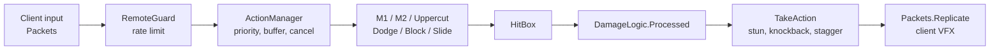

# Game C — Merger Audit & Design

2026-09-24 · Jay · Live version: the "Game C — Merger Audit & Design" Claude Doc. This file is a snapshot of it.

## Overview

This doc audits two Roblox codebases and will turn them into one design, Game C. It covers phases 1–2 (audit and comparison) first, then the interview, then the design.

| | Game A | Game B |
| --- | --- | --- |
| Studio place | "Map + Combat" (placeId 87872916277829) | "animation farm" (placeId 72078340292677) → `ServerStorage.CC` |
| Theme | Dorohedoro-inspired (your project) | Bleach-inspired (packed game, `v_Aug_17`, package README dated 3/27/2024) |
| Live source | ~340k lines (includes ~8 MB vendored ReactLua) | ~32 MB of source in 1,899 scripts |
| State | Active development, backups dated 2026-09-23/24 | Complete packaged game, unpacks on load |

**Method:** scripts were read directly from Studio through the MCP bridge. Vendored libraries (React, Packages, Cmdr) are noted but not audited line by line. Backup and archive folders are skipped unless live code depends on them.

**Status:** Phases 1–2 done; interview round 1 answered; Game C design comes after the interview.

## Game A — "The Hole" (Map + Combat)

Game A is an open-city Smoke-sorcerer brawler. Its combat and back end are deep, but its progression and endgame are thin. The strongest code is in combat (ActionManager → DamageLogic), and the world runs on about 50 small data-driven services. It began as a JJK base kit (`ProgressionConfig` still names "jjk's leftover" systems), and most of that kit has since been replaced.

### Core gameplay loop

Spawn in the Hole → walk or Smoke-door to a quest giver or job board → fight zombies, thieves or militia, or run errands → earn Yen and Burial Tags → buy food buffs and gear → random world events every 4–8 minutes pull players together (Blue Night, Field Boss, Killing Field) → PvP kills fill the server-wide War meter → at 100 a Riot doubles rewards and pays for kills.

### Progression

| Track | How it grows | Cap | What it gives |
| --- | --- | --- | --- |
| Level (derived from XP) | 40 XP per PvP kill, 60 per quest turn-in | 50 (32,340 XP) | Title + 1 attribute point per level |
| Attributes (T menu) | Points from levels, quests and the Grave Keeper (10 tags each) | 20 ranks × 4 (Smoke, Strength, Toughness, Vitality) | Rank 20 ≈ +70% of that stat. Respec: first free, then ¥250 with a 10-minute cooldown |
| Use-based stats (P-06) | Training at the Fight Club, or use; hourly caps | 50 | Only Endurance does anything (+3 HP per level). Weapon and Durability are saved but unused |
| Smoke type | Rolled once, weighted: Split 20, Gun 20, Regen 18, Mushroom 18, Curse 12, Lizard 8, Dinosaur 4 | — | 2–3 moves on Z/X/C. No reroll |
| Quirks | Rolled once: 1 good + 1 bad | — | ±5–15% to HP, Smoke, speed, damage; food-related quirks |
| Gear | Bought: 6 weapons, 6 equipment pieces, 1 quest mask | — | Flat ±5–20% modifiers |
| Gang rep | Killing Ashmask raiders | 100, decays 5/day after 24 h | Unlocks gang dialogue (10) and premium shop rows (30) |

At 100 XP per quest, level 50 takes about 540 quest completions. Maxing all attributes needs 80 points, but levels give only 49. The gap is filled with tag purchases, which makes Burial Tags the real long-term currency.

### Combat

The server is authoritative. The client sends input packets (buffer-encoded `Packet` library), the server runs action modules, and state is replicated back as VFX events.

Every hit passes through `DamageLogic.Processed`, which checks these in order: safe zone → spawn grace → 45-stud reach check → speed-hack check → multiplier stack → i-frames (perfect dodge) → parry → ragdoll → block and posture → stagger gain → world hooks.

- **M1:** 4–5 hit combos per weapon, plus running and aerial variants. Air combat has an air-weld juggle and a downslam finisher.
- **M2 (heavy):** separate module per weapon. A landed M2 silences Smoke users for 2.5 s.
- **Block, parry and posture:** block opens with a 0.25 s parry window. A clean parry gives the defender a 1 s Riposte (+25% damage). Blocked hits add posture (damage × 1.7) and deal 15% chip damage. At 100 posture the guard breaks and the player is Paralyzed. Posture drains after 2 s without a hit.
- **Stagger meter:** built only by skilled play (being parried +40, eating a counter +30, unblocked heavy +20, being interrupted +12). At 100 it opens a Finisher window: the next M2 deals ×1.5.
- **Dodge:** has i-frames. A perfect dodge (hit lands inside the i-frames) resets the Dodge cooldown and makes the next hit ×1.3.
- **Feint:** cancels an M1 into a feint on a 3 s cooldown.
- **Input buffer:** 0.6 s. Dodge and Block may cancel an attack's recovery, but only after its hitbox has fired.
- **Smoke moves:** cost Smoke from a flat 200 bar. Landed M1s refund 1.5% of the bar. Types range from DoT (Curse) and traps (Mushroom) to transformation forms (Lizard, Dinosaur).
- **Weapons:** Katana, Fist, Axe, Trident, Dagger, Sword and SwordShield. Only Katana and Fist have published animations; the other five use `rbxassetid://0`, borrowed Fist clips or placeholders.

### Character development

There is one origin, Sorcerer. Human is coded, but its roll chance is 0. The build space is: Smoke type (random) × weapon × attribute spread × 3 gear slots × quirks. Vows (Fists, Flames) exist as modules but are switched off. A Devil Awakening trial is scaffolded in 4 stages with fail-on-death, but its content is still TODO.

### Content

| Type | What exists |
| --- | --- |
| Map | Hole city: Shibuya-style streets, SecondWard, Brick Estate, Lab, Warehouse, Food Alley. 29 POIs, 3 danger zones (Kanon Park D1, Old Town Backstreets D2, Port Island D3), 3 secrets, 2 safe zones (The Diner, Hell), 34 event spots |
| Second place | Zogan's Academy Grounds, a separate place used by the tutorial questline |
| NPCs | 15 dialogue NPCs: Liaison, Madame Ise, the Grave Keeper, the arms dealer, 4 food-alley vendors, the Trainer, Dr. Mizoguchi and others |
| Quests | 28: a 9-step Enrollment chain, a 4-step Advanced chain and 15 repeatables (cooldowns of 8–30 minutes) |
| Events | 12 random events: Smoke Surge, Supply Cache, Whisper, Toxic Rain, Blue Night, Cleanup Day, Ghost Night, Rule of the Hour, Party Mishap, Killing Field, Ashmask Sweep, Field Boss (The Skinner) |
| Enemies | Zombie, Specimen, Night Stalker, Thief, Ashmask grunt and captain, Proctor Dunmore (420 HP), The Skinner (800 HP, scales with players). Archetypes: Shield, Rusher, Thrower, Flanker |
| Exploration | 7 Smoke doors (toll fast travel), 8 hidden Hell entrances (the reward for finding all is the Devil's Mask), Grudge Monument, rumor board, discovery toasts |

### Economy

- **Currencies:** Yen and Burial Tags. Tags cash out at ¥30–35 each and also buy attribute points.
- **Faucets:** quests (¥40–300), jobs (¥80 + 2 tags), events (¥15–150), Riot kills (¥25), Killing Field kills (¥20).
- **Sinks:** food buffs (¥35–250), gear (¥250–500 each, about ¥4,300 for everything), door tolls (¥30/60), respec (¥250), Black Smoke (¥120).
- **Guardrails:** Yen can't go negative or fractional, save data is sanitised on load, and every change is logged to `EconomyLog` and Roblox Analytics.
- **No trading.**

### PvP

PvP is open everywhere except safe zones. PvP kills give XP (40), Elo rating (K = 24, with a leaderboard), War meter progress and bonus Yen during a Riot or Killing Field. Party members can still hit each other; there is no friendly-fire rule.

### PvE

PvE comes from quest mobs, job-board zombie hunts, events and one field boss. The AI stack is solid: NPCController (37k chars), a swarm token system (only N attackers at once), navigation, ranged throwers and archetypes. Mobs and bosses gain +35% health and damage per extra nearby player, capped at ×2.5. BossService supports phases at health thresholds.

### Death

There is almost no penalty: a 3 s respawn followed by 3 s of spawn grace. Nothing is lost — no items, Yen or XP. The only death rules are that Hex hits harder if the caster dies and that dying mid-trial resets the Devil Trial.

### Endgame

There effectively isn't one. The reachable goals are level 50, 80 attribute ranks, Elo ladder rank, all Hell entrances and the Devil Trial (unfinished).

### Social

- **Parties:** in-server only, via chat commands and a React panel.
- **Clans:** saved in a DataStore. Created with chat commands and not race-safe. They have no gameplay effect.
- **Contracts:** Blue Night partner contracts record a pair but have no effect yet.
- **Leaderboards:** QuestsDone, BurialTags and Rating.

### Technical architecture

- **Two layers:** a Services layer (inherited kit: ActionManager, EntityLoader, AI, Data) and a World layer. The World layer is about 50 Scripts and Modules that talk through `ServerStorage.WorldSignals` Bindables and player attributes.
- **Data:** ProfileService with session locking, versioned migrations and a sanitiser. One store, `PlayerData_v1`, is shared across places.
- **Networking:** buffer packets for combat and plain Remotes for the World layer, rate-limited by `RemoteGuard` (token buckets, kick on abuse).
- **UI:** mixed. A React HUD (`ReactHudClient`, HudUI widgets), older ScreenGui scripts, and leftovers from the kit.
- **Tooling:** Cmdr admin commands and a 36k-char `SelfTest` harness for Studio.
- **Dead code:** `StarterGui.SkillTree` (Portuguese, needs a missing `Modules.SkillsReqs`), the `PurchaseSkill` and `DevProductNotif` remotes, a disabled Ghoul/CCG ProgressionService, and 7 dated backup folders in ServerStorage.

### Strengths

1. The combat has real depth: parry → riposte, perfect dodge → counter, stagger → finisher, posture, feints, air juggles and an input buffer. Skill wins fights.
2. It is secure by default: every remote is rate-limited, hits are checked for reach and speed server-side, and actions are allowlisted.
3. The world has personality. Events like Rule of the Hour, Ghost Night and Blue Night, plus hidden Hell entrances and the Grudge Monument, make the city feel alive.
4. The code is data-driven. Quests, events, shops, Smoke moves and archetypes are config tables, so content is cheap to add.
5. The save layer is production quality: ProfileService, migrations, sanitising and an economy log.

### Weaknesses

1. **No stakes.** Free death, no loot drops and no item loss mean PvP has no tension beyond Elo.
2. **Thin power curve.** Level 50 takes about 540 quests, but each level only gives 1 point and a title. The numbers are small, and the gear ceiling is reached in a few hours.
3. **Economy dead-ends.** Once the 12 gear items are bought, Yen only goes to food and tolls.
4. **One-shot randomness with no path forward.** Smoke type and quirks roll once, with no reroll or pity. A 4% Dinosaur roll is permanent.
5. **Stubbed systems.** Contracts, Devil Trial stages, clans and Vows exist but do nothing yet.
6. **Content is placeholder.** Five of seven weapons have no animations, and equipment uses part-built visuals.
7. **Hard to keep consistent.** There are about 50 services and several UI generations, and many systems communicate only through attributes.

## Game B — Soul-realm faction MMO (CC package)

Game B is a large Bleach-style faction MMO. Its biggest draws are **race transformation** and a **social hierarchy**. It gets there with heavy RNG, long timers and code that can't be maintained.

**Provenance: read this first.** Dozens of scripts carry the header `Saved by UniversalSynSaveInstance (Join to Copy Games)`, and much of the code is decompiled output (`v0`, `v1`… variable names). This package was ripped from someone else's live game with an exploit tool. Place names, the `TYPETEST` flags and the database name point to the Type://Soul family of games. None of its code, models, animations, VFX or maps can ship in a game you publish. **Game B is a design reference only.**

**Security findings (do not bring these files into Game A):**

- **Bytecode VM:** `NPCBoss.Data.Main` contains `FiOne`, a Lua bytecode interpreter that runs code through `setfenv`. That is the standard way to hide a backdoor.
- **Asset loading:** the `Shinigami` state machine pulls in `InsertService`.
- **Live secrets:** Discord webhook URLs are hard-coded in `Webhooks` and `FactionManager`. They are left out of this doc on purpose.
- **Outbound calls:** `Teleports` calls an external IP-geolocation API, and `FirebaseService` posts to an outside database.
- **Game A is clean.** A scan of the "Map + Combat" place found none of these markers.

### Core gameplay loop

Spawn as a Lost Soul → pick a path (Shinigami, Hollow, later Quincy) → grind EXP on NPCs, missions and PvP → rank up through grades (each rank has an EXP target, a minimum time at rank and, at higher ranks, PvP "grips") → unlock a release (Shikai, Res or Vollstandig) → join a faction's division and raids → chase Bankai or its equivalent and rare rolls.

### Progression

| Track | How it works |
| --- | --- |
| Race path | Lost Soul → Shinigami or Hollow. Hollows evolve Frisker → Fishbone → Menos → Adjuchas → Vasto Lorde, dying and respawning at each stage. Late hybrids: Arrancar, Vastocar, Visored. Quincy is its own faction |
| Rank grades | 14 grades from Trainee through Grade 5–1 and Special Grade to Semi-Elite and Elite. Each needs 20 EXP (×4 multiplier, ×0.7 for Shinigami) plus a minimum time at rank. Top ranks also need PvP grips, raid grips and division EXP |
| Shikai personality | Rolled: Kind Hearted, Squeamish, Vengeful, Hateful, Chaotic or Pure. Decides which activities feed release EXP (Hateful needs grips; Pure needs Hollow kills) |
| Stats | SP spent on Hakuda, Kendo, Kido, Speed, Healing and Bladedancer. Each scales a different system (Kendo scales posture damage; Speed scales flashstep) |
| Skills | Unlocked by SP thresholds, skill boxes (loot) and essences. There are 366 server skill modules |
| Releases | Rolled from rarity pools: common, rare, legendary, mythical (about 30 Shikai, 23 Res, 17 Vollstandig). Bankai needs a fight, time at rank and kill counts. True Bankai has a 12-hour cooldown |
| Identity rolls | Weapon type (1% rare), zanpakuto name and callout (10% rare), hilt and colours, eyes, 10% marking chance, clan (common, then legendary 3%, mythical 1%, "Hell" 0.5%) |
| Rerolls | Items, capped at 500–1,500 per type, sold through developer products |

### Combat

Combat runs on a state machine per entity type. Its core pieces:

- **Light attacks and posture:** block adds posture (base 50, scaled by Kendo). A posture break opens the defender up.
- **Deflect:** parrying stuns the attacker for `ParryStunTime`. There is a 0.4 s auto-parry frame.
- **Other defence:** counters on a 20 s cooldown, hyperarmor, and weapon clashes (`ClashSystem`).
- **Movement and pressure:** flashstep scales with Speed, and critical strikes are tied to the release.
- **Artifacts:** they change the defensive rules, for example extra block chip, a parry that absorbs Reiatsu, or reduced posture damage.
- **Resources:** skills cost Reiatsu. Releases add meter modes with regen buffs (Res +30%, Vollstandig +35%).

### Content

- **Places:** 9+ places — Main Menu, Karakura Town (shared hub), Soul Society, Rukon District, Hueco Mundo, Las Noches, Wandenreich City, a Clan War lobby and the Dangai travel corridor. Gates (Senkaimon, Garganta) can be broken, with 45 s cooldowns.
- **Enemies:** about 50 NPC and boss state machines: Lost Soul, Frisker, Fishbone, Menos, Adjuchas, Vasto Lorde, Jidanbo, Nozarashi, Visored, and more than 30 named bosses.
- **Activities:** boss raids with voting, party missions through queues (rank-gated), bounty board, Stalker missions, a timed AFK world, codes and weekend loot events.
- **Game modes:** Gladiator (lives), Art of Soul, King's Gambit, Soul Shuffle, Clan War, Championship and ranked arena.

### Economy

- **Currency:** Kan.
- **Items:** over 500 tradeables across accessories (10 slots), items, artifacts and clan items. Rarity counts: Common 16, Uncommon 5, Rare 20, Legendary 79, Mythical 103, Limited 12, plus 150 marked Unobtainable (developer-only).
- **Prices:** sell values from 150 (Common) to 4,000 (Legendary). Legendary accessories cost 40,000.
- **Faucets:** world lootboxes, raids, missions and codes, plus weekend multipliers of ×10 and ×20.
- **Trading:** full player trading (`TradeManager`).
- **Monetization:** developer products for rerolls and boxes, with a purchase-history receipt ledger.

### PvP

Full-loot-lite PvP built on **knock → carry → grip (execute)**. At 0 HP a player is knocked out for 12 s. The attacker can carry them, execute them (which counts toward rank-up) or let them get up. A 60 s combat tag punishes logging out mid-fight. Bounties go on repeat killers, jail has bail, and ranked Elo has a soft cap. Faction wars include Karakura raids, invasions, Quincy hunts, capture items and flags.

### PvE

The AI is state-machine driven. Each boss is a separate 170k-character copy of the same template, about 8 MB in total. Raids track damage contribution, scale respawn timers (30 s, +10 per death) and grant faction-wide raid buffs.

### Death

Death has real stakes:

- **Base respawn:** 3 s. In raids it is 30 s (+10 per death); in hunts it is 60 s (+30 per death).
- **Executions:** being gripped counts for the killer's progression.
- **Losses:** Hollows lose 5 of the 18 mask cracks they need. Release EXP can drop 10%. Held capture items, flags and dropped items fall to the ground, and Kan can be dropped.
- **Combat logging:** leaving mid-fight is recorded against the player.

### Endgame

Top division positions (Captain, Espada, Sternritter, King), True Bankai and the late forms, the ranked ladder and championship titles, mythical rolls, clan wars and rare cosmetics.

### Social

- **Factions:** Shinigami, Arrancar and Quincy.
- **Divisions:** 13 squads with ranked positions.
- **Clans:** DataStore rosters and clan wars.
- **Other:** parties with a mission queue, trading, titles, and cross-server messaging for admin actions.

### Technical architecture

- **Server layout:** Managers (Data, Faction, Division, Rank, Combat, Trade, AntiCheat) plus `EntityStateMachines`. The `Shinigami` state machine alone is 841k characters.
- **Client layout:** skill, release and VFX modules, about 5.4 MB.
- **Data:** ProfileService with rollback and version queries. Admin IDs are hard-coded.
- **Anti-cheat:** position, flight and noclip checks, remote history, and auto-ban on malformed input.
- **Duplication:** 7+ OLD or BACKUP copies of live managers. `FactionManager` has three near-identical variants of about 300k characters each.

### Strengths

1. **Transformation fantasy.** Evolving from Lost Soul to Hollow to Vasto Lorde, or Shinigami to Bankai, gives obvious, visible power spikes to chase.
2. **Personality-gated progression.** The same goal is reached through different activities, which nudges players into different playstyles.
3. **Knock → grip → execute.** Kills are a choice with consequences: mercy, execution, bounties, jail.
4. **Social hierarchy.** Division seats, faction raids and clan wars give players status to fight over.
5. **Distinct realms.** Each realm has its own identity, and travel between them (Dangai, gates) feels like a journey.

### Weaknesses

1. **Gacha everywhere.** Identity, weapon, release and clan are rolls; rerolls are paid; mythical pools and developer-only items exist. That creates pay-to-win pressure and frustrates players who roll badly.
2. **Time gates.** Minimum time per rank, a 12-hour True Bankai cooldown and AFK worlds stretch play instead of deepening it.
3. **Forced PvP.** Rank-ups need player grips, which locks PvE-focused players out.
4. **Inflation.** Weekend ×10 to ×20 multipliers and code handouts devalue the loot chase.
5. **Overwhelming for new players.** Nine places, six stats, dozens of forms and more than eight game modes.
6. **Code can't be maintained.** It is copy-paste bosses, decompiled output, hard-coded secrets and a probable backdoor, on top of the IP problem.

## System-by-system comparison

Game A supplies the engine: combat, data, world services and security. Game B supplies ideas for stakes, identity and long-term goals. Every B concept is rebuilt inside A's code. These verdicts are provisional until the interview confirms direction.

| System | Game A | Game B | Verdict | Why |
| --- | --- | --- | --- | --- |
| Combat | ActionManager + DamageLogic, server-authoritative | Per-entity state machines, deflect, counter, clash | **Keep A**, merge clash and hyperarmor | A is cleaner and already secured; clash and hyperarmor fill gaps for bosses and heavies |
| Movement | Sprint, slide, dodge, aerial, feint | Flashstep scaled by the Speed stat | **Keep A**, add mobility as a build option | A's feel is tuned; B's idea of a stat that shapes mobility adds build variety |
| Blocking | Posture 0–100, 15% chip, drains after 2 s | Posture scaled by Kendo, artifact modifiers | **Keep A** | Expose posture multipliers as stat and gear hooks |
| Parrying | 0.25 s window → Riposte, auto-parry follow-up | Deflect + parry stun, counter on a 20 s cooldown | **Keep A** | A already rewards the parry with Riposte and stagger |
| Dodging | I-frames, perfect dodge → counter | Flashstep only | **Keep A** | B has no equivalent |
| Abilities | Smoke type (2–3 moves), rolled once | 366 skills, releases rolled from rarity pools | **Rebuild** | Keep A's type identity; add earned unlocks and staged releases instead of one roll |
| Weapons | 7 buyable; 5 have no animations | Rolled weapon type with rarity | **Keep A** | Weapons are bought or earned, never rolled; the gap is animation work |
| Classes | None | Class field (9 modules) | **Remove** | Smoke type and weapon already define a role; a class would overlap |
| Races | Sorcerer only (Human coded at 0%) | Lost Soul → branching races and evolutions | **Merge** | A already has Human, Sorcerer and a Devil trial scaffold; B's transformation arc makes them a path |
| Stats | 4 attributes + 3 unused use-stats | 6 SP stats, each scaling a system | **Rebuild** | One stat system; drop the unused use-stats; each stat should change how you play, not just a number |
| Leveling | Level 1–50 from quest and PvP XP | Rank grades with EXP + time + grips | **Rebuild** | Named ranks with activity requirements, no wall-clock timers |
| Talents | Quirks (random good + bad) | Shikai personality gates EXP sources | **Merge** | Quirks become "temperament": it picks which activities speed your growth, not a flat stat |
| Skills | Smoke moves only | Skill boxes, SP-threshold trees | **Rebuild** | A small earned skill pool per Smoke type |
| Quests | 28 data-driven, 7 step types | Queue missions with rank gates | **Keep A** | A's quest engine is better; add rank gates |
| NPCs | 15 dialogue NPCs, actions, rep gates | Large NPC handler | **Keep A** | A's dialogue system is data-driven |
| Bosses | Proctor, The Skinner; BossService phases | 30+ copy-pasted bosses | **Keep A** framework | Add bosses as config + phase functions, never copies |
| Dungeons | None | Boss raids with voting, hunts | **New** (B-inspired) | Build on A's Survive/Kill steps, Mobs and BossService |
| World | One city + Academy place | 9+ realm places with gates | **Keep A**, grow slowly | One dense city plus a few gated places, not nine |
| Exploration | Doors, Hell entrances, secrets, rumors | Realm gates, Dangai | **Keep A** | A's discovery loop is its best non-combat feature |
| Loot | Mobs drop nothing | Lootboxes, rarity tiers | **New** | Game C needs drop tables |
| Inventory | 4 slots + consumables | 10 accessory slots + hotbar | **Keep A**, expand | 5–6 slots is enough |
| Economy | Yen + Burial Tags | Kan + rarity + paid rerolls | **Keep A** currencies, add sinks | No paid rerolls of power |
| Trading | None | Full trading | **Rebuild later** | Only once the loot table exists, with anti-dupe on UpdateAsync |
| Death | Nothing lost | Knock → carry → grip, drops, losses | **Merge** | A needs stakes; B's knock-down gives choice instead of instant loss |
| Respawning | 3 s + 3 s grace | 3 / 30 / 60 s, scaling per death | **Keep A**, add scaling in raids | |
| PvP | Open, Elo, War meter, Riots | Faction wars, bounties, jail | **Merge** | A's War meter plus B's bounty and jail give PvP consequences |
| PvE | Events, jobs, one field boss | Raids, hunts, bosses | **Keep A** + raids | |
| Factions | En's Gang rep (1 gang) | 3 factions with division seats | **Merge** | A's gang rep becomes factions with ranks and seats |
| Guilds | Clans (no effect, race-unsafe) | Clans + clan wars | **Rebuild** | After factions; decide whether clans or factions are the social unit |
| Parties | In-server, React panel | Parties + mission queue | **Keep A** | Add party-based credit sharing |
| Events | 12 random world events | Weekend loot ×10–×20, raids | **Keep A** | Drop reward multipliers — they inflate the economy |
| Crafting | None | Essences (partial) | **Optional** | Only if loot needs a second sink |
| Shops | 8 shops, rep-gated rows | Market rotation | **Keep A** | Add rotation later |
| Progression | Thin (1 point per level) | Deep but time-gated | **Rebuild** | The core problem to solve in Game C |
| Endgame | None | Seats, True Bankai, ranked, mythic rolls | **New** (B-inspired) | Seats + late transformations + ranked |
| UI | React HUD + legacy ScreenGuis | Many ScreenGuis | **Keep A** React HUD | Remove legacy UI |
| Data saving | ProfileService + migrations + sanitiser | ProfileService + rollback | **Keep A** | Add a rollback admin command (concept only) |
| Anti-exploit | RemoteGuard, reach/speed checks | Movement, flight and noclip checks | **Keep A** + movement checks | |

## Code triage

Only Game A's code is a candidate for reuse, and most of it is. Game B contributes design concepts, which get reimplemented from scratch in A's architecture.

### Reusable (Game A, keep as-is or with light edits)

| System | Main scripts | Depends on | Why keep |
| --- | --- | --- | --- |
| Combat core | `Services.Player.ActionManager` + action modules, `ServerStorage.Packages.DamageLogic`, `HitBox`, `AirCombat` | StateManager, TagService, TrackService, Packets, EntityLoader, RemoteGuard | Deep, tuned, server-authoritative, with reach and speed checks |
| Networking | `Remotes.Packets` / `UnPackets`, `World.RemoteGuard` | Packet library (buffers) | Compact, rate-limited, allowlisted actions |
| Save layer | `Services.Player.Data`, `World.DataMigrations`, `EconomyLog`, `DataStoreRetry` | ProfileService | Session locking, versioned migrations, sanitiser, analytics |
| AI | `Services.AI.AI` (NPCController, Swarm, Navigation, Ranged), `Config.NPCArchetypes` | ActionManager, DamageLogic, SimplePath | Archetypes and attack tokens make readable PvE |
| Mobs and bosses | `World.Mobs`, `MobScaling`, `BossService` | AI | Spawn, scale and phase from config |
| Quests | `World.QuestService`, `World.Quests` | WorldSignals, Mobs, NPCService | 7 step types, cross-place, repeatables |
| World layer | `WorldService`, `WorldQuery`, `POIIndexService`, `DoorService`, `HellService`, `RumorService`, `EventService` | WorldMarkers, CollectionService tags | Discovery and events are A's identity |
| NPCs and shops | `NPCService`, `Dialogues`, `EconomyService`, `Shops` | Guard, Reputation | Data-driven dialogue, rep gates |
| Items and buffs | `InventoryService`, `Items`, `Buffs` | Attributes read by DamageLogic | Simple and working |
| Ops | `ModerationService`, `SettingsService`, Cmdr, `SelfTest` | DataStoreRetry | Bans, per-player settings, admin commands, test harness |
| UI | `ReactHudClient`, `HudUI` | ReactLua | Newest UI generation; standardise on it |

### Rebuild (keep the concept, rewrite the code)

| System | Problem | Rebuild as |
| --- | --- | --- |
| `ProgressionService` + `ProgressionConfig` | 50 levels that each give only 1 point | Named ranks with activity requirements (B's grades, without timers) |
| `Stats` + `StatConfig` | Weapon and Durability XP are saved but do nothing | Fold into one stat system, or delete |
| `SmokeMoveService` roll | One permanent roll, no path forward | Rolled starting type + earned unlocks, a pity or reroll quest, staged forms |
| `ClanService` | Chat commands only; get-then-set races on the roster | UpdateAsync roster with React UI, after the faction decision |
| `Contracts` / `DevilTrial` | Scaffolding with no effect or content | Real stages hooked into the transformation path |
| Weapons 3–7 | `rbxassetid://0`, borrowed Fist clips | Animate or cut; ship 3–4 finished weapons rather than 7 half-done |

### Remove

- `StarterGui.SkillTree` (dead JJK kit UI, needs a missing `Modules.SkillsReqs`) and the `PurchaseSkill` and `DevProductNotif` remotes.
- The disabled Ghoul/CCG ProgressionService and the legacy `TumorGrade` save field (by migration).
- Seven `Backup_*` / `Archive_*` folders in ServerStorage. Move them to a local file, because they bloat the place and confuse search.
- About 90 loose parts and models in the root of `Workspace.Map`. Move them into region folders.

### Merge (Game B concept → Game A code)

| Concept from B | Where it lands in A |
| --- | --- |
| Knock → carry → grip (execute) | New `Downed` state in StateManager; a DamageLogic.TakeAction hook replaces instant death in PvP |
| Personality-gated growth | QuirkService → temperament; ProgressionService reads which activity feeds rank EXP |
| Staged transformations | SmokeMoveService forms + the DevilTrial pipeline |
| Faction seats | Reputation module generalised to several factions; seats as a ranked list per faction |
| Bounty and jail | WarService + WorldSignals.PlayerKilled |
| Raid contribution credit | Mobs `CreditRange` → damage-share tracking in BossService |
| Clash and hyperarmor | DamageLogic.Processed (hyperarmor = ignore stun) and a clash branch when two M2s meet |

### Optional (later, not in the first build)

Trading, crafting and essences, arena game modes (Gladiator, King's Gambit), ranked seasons, and more realm places.

### Game B migration verdict

**Nothing moves.** Every B system above is rebuilt from its idea, not its code. There are three reasons:

1. **Ownership:** B was ripped from another developer's game.
2. **Safety:** it contains a bytecode VM and live secrets.
3. **Maintainability:** decompiled, copy-pasted code can't be maintained.

Keep the `animation farm` place away from your published place, and never paste CC scripts or models into it.

## Interview log

Round 1 covers the decisions everything else depends on. Answers get recorded here as they come in; the newest answer wins if two conflict.

### Round 1 — identity and stakes (asked 2026-09-24)

| # | Question | Answer |
| --- | --- | --- |
| 1 | PvP, PvE or a mix — and where is PvP allowed? | **Mixed, zoned.** PvE progression everywhere. PvP is open in danger zones and during events (Riot, Killing Field). Safe zones stay safe. |
| 2 | What should death cost? | **Knock-down + soft loss.** At 0 HP you are downed; the attacker can spare, carry or execute. An execution drops a share of carried Yen and Tags. Gear and progression are never lost. |
| 3 | How is a character's power identity decided? | **Rolled and permanent.** Smoke type stays a one-time roll. Rerolls exist only as rare drops, so the roll is a long-term chase. |
| 4 | What goes in the public GitHub repo? | **Everything**, including the provenance and security sections. |

### Round 2 — world, progression, endgame, combat balance (asked 2026-09-24)

| # | Question | Answer |
| --- | --- | --- |
| 5 | How big is the world at launch? | **Hole + Sorcerer World.** Two main hubs from day one, linked by Smoke doors. |
| 6 | What shape does long-term progression take? | **Named ranks.** About 10 ranks, each unlocked by a mix of activities, no wall-clock timers, a visible reward per rank. |
| 7 | What is the late-game power fantasy? | **Devil path.** Finishing the Devil Awakening trial transforms you into a devil: rare, hard, lost on death mid-trial. |
| 8 | Weapon vs Smoke power? | **Equal partners.** Weapons carry melee; Smoke gives 2–3 signature moves. A weak roll stays viable through weapon mastery. |

**Tension to resolve in round 3:** a permanent Smoke roll (answer 3) plus equal weapon power (answer 8) means weapon mastery has to be deep enough to carry a player with a weak roll.

### Round 3 — combat (asked 2026-09-24)

| # | Question | Answer |
| --- | --- | --- |
| 9 | How much of Game A's combat kit stays? | **All of it:** parry → riposte, perfect dodge → counter, stagger → finisher, feints and air juggles. |
| 10 | Add Game B's hyperarmor and clashes? | **Hyperarmor for bosses and heavies only.** Certain boss swings and slow-weapon attacks (Axe) can't be flinched. No clashes. |
| 11 | Keep the 2.5 s Smoke silence on a landed M2? | **Keep 2.5 s.** It is melee's main answer to Smoke-heavy players. |
| 12 | Should mobility vary between builds? | **Through Smoke and gear, not a stat.** Everyone shares the same base movement; some Smoke types or gear add mobility. |

### Round 4 — weapons and Smoke (asked 2026-09-24)

| # | Question | Answer |
| --- | --- | --- |
| 13 | Which weapons ship at launch? | **Katana + Fist only.** More come in later updates. |
| 14 | How does weapon mastery work? | **No mastery.** Weapons are equal from the start; only player skill matters. |
| 15 | How are Smoke moves obtained? | **All at once.** Every move of your type from the start, as in Game A now. |
| 16 | Are rarer Smoke types stronger? | **Rarer = flashier, not stronger.** Keep the roll odds, but balance every type to be equally viable. |

**Resolved:** balancing every type equally (16) takes care of the weak-roll tension from round 2, so mastery isn't needed.

**New tension:** named ranks need a visible reward per rank (6), but moves come all at once (15) and there is no mastery (14). Rank rewards will have to come from somewhere else, such as gear slots, Smoke capacity, access to areas, titles and cosmetics, or Devil-trial eligibility.

### Round 5 — character development (asked 2026-09-24)

| # | Question | Answer |
| --- | --- | --- |
| 17 | Which origins exist? | **Sorcerer only, for now.** Other starting origins may come later, such as a lesser devil or other Dorohedoro-based starts. |
| 18 | Keep the 4 attributes? | **Keep, but lower the ceiling** from about +70% to about +30% at max, so skill matters more than grind. |
| 19 | What happens to quirks? | **Turn into temperament.** Like Game B's personalities: the roll decides which activities speed your rank-ups. |
| 20 | What happens to Vows? | **Remove** the Vow code. |

### Round 6 — progression and ranks (asked 2026-09-24)

| # | Question | Answer |
| --- | --- | --- |
| 21 | Where do attribute points come from? | **Rank-ups.** Each rank grants a batch of points, which also gives every rank a visible reward (resolves the round 4 tension). |
| 22 | What do rank-ups require? | **PvP required at high ranks.** Like Game B's grips, the top ranks need executions or wins in PvP zones. |
| 23 | How does temperament affect progression? | **Bonus, not a lock.** Every activity counts; your temperament's favorite activities give extra rank progress. |
| 24 | How long to max rank? | **About 40–60 hours** for an average player. |

**Note:** PvP is only allowed in danger zones and events (answer 1), so high-rank players must enter them. That makes the danger zones the endgame arena. The design must stop farming friends for executions: no credit for repeat kills on the same victim, and a victim-rank floor.

### Round 7 — content (asked 2026-09-24)

| # | Question | Answer |
| --- | --- | --- |
| 25 | Where does the Academy live? | **Inside Sorcerer World.** The tutorial happens in the Academy district, then players take a door to the Hole. |
| 26 | Dungeons? | **None.** Events and field bosses carry group PvE. |
| 27 | Boss types at launch? | **Field + dungeon + story.** With no dungeons (26), this is read as **field bosses + story bosses**. |
| 28 | Quest balance? | **Mostly repeatables.** Boards, jobs and events, with minimal story. |

### Round 8 — world (asked 2026-09-24)

| # | Question | Answer |
| --- | --- | --- |
| 29 | Bosses: which did you mean? | **Field + story bosses only.** No dungeons (confirms 26 and 27). |
| 30 | What happens to the 12 world events? | **Keep the best, cut the rest** (about 6). Which ones is asked in round 9. |
| 31 | How does travel work across two hubs? | **Walk only inside hubs.** Doors only link the Hole and Sorcerer World; no teleporting within a hub. |
| 32 | What is Hell for? | **Its own separate place later**, like Sorcerer World. Hell is not needed for the Devil progression. |

**Knock-on effects:**

- Removing in-hub toll doors removes a Yen sink (¥30/60 per trip), so the economy needs a replacement.
- The 8 hidden Hell entrances and the Devil's Mask reward lose their purpose until the Hell place exists. They can stay as a hidden collectible or be switched off until then.

### Round 9 — events and Hell entrances (asked 2026-09-24)

| # | Question | Answer |
| --- | --- | --- |
| 33 | Big events kept | **Blue Night** only. Field Boss, Killing Field and Ashmask Sweep are cut. |
| 34 | Strange events kept | **Toxic Rain** only. Ghost Night, Rule of the Hour and Party Mishap are cut. |
| 35 | Small events kept | **None.** Smoke Surge, Supply Cache, Whisper and Cleanup Day are cut. |
| 36 | Hell entrances and the Devil's Mask | **Remove.** Hell's entrances will be designed fresh with the Hell place. |

**Knock-on effects:**

- **Field bosses (29):** the only field boss today spawns through the Field Boss event. Field bosses now need their own spawn rule, such as a timer or a spot in a danger zone.
- **Gang rep:** it is earned only from Ashmask raiders. Cutting the Ashmask Sweep leaves En's Gang rep with no source.
- **Code to remove:** Ghost Night drives the Ghost-shy quirk, and Party Mishap drives the Party Cake buff. Both go with their events.
- **World feel:** with 2 of 12 events left, the world's life has to come from repeatables, bosses and PvP zones.

### Round 10 — factions and social (asked 2026-09-24)

| # | Question | Answer |
| --- | --- | --- |
| 37 | What are the factions? | **2 rival factions**, such as En's Family and Cross-Eyes. You join one; rep comes from missions and PvP against the other; danger zones are contested turf. |
| 38 | Limited seats? | **Contested seats.** A few named seats per faction, held by top players and challengeable in duels. This is the social endgame. |
| 39 | What happens to clans? | **Remove clans.** Factions and parties cover grouping. |
| 40 | Party changes? | **Shared credit + no friendly fire.** Nearby party members share kill and quest credit and can't damage each other. |

**Resolved:** faction missions and PvP replace the Ashmask Sweep as the source of rep (round 9).

### Round 11 — loot and economy (asked 2026-09-24)

| # | Question | Answer |
| --- | --- | --- |
| 41 | What does loot look like? | **Drop tables with rare gear.** Mobs drop Yen and tags and sometimes gear; bosses have their own tables with rare gear and the rare Smoke reroll item. |
| 42 | What are the currencies? | **Yen + Tags, Tags repurposed.** Yen for everyday buying; Tags stay a rare Blue Night currency for special items, no longer for attribute points. |
| 43 | What are the Yen sinks? | Based on how Kan is spent in Game B (table below): **gear shop + rotating market, cosmetics (barber, outfits), and an endgame exchange** (a huge Yen + rare item cost for part of the Devil path). No rank-up fee. |
| 44 | Which transfers and penalties? | **Combat-log penalty** and **drop/give Yen**. No bounty/jail and no arena betting. |
| 45 | Trading? | **Not at launch.** Add it later, once loot exists, with anti-dupe safeguards. |

**How Game B spends Kan** (reference for answer 43):

| Kan sink | Cost | Kind |
| --- | --- | --- |
| Accessory shop | Up to 40,000 (Legendary) | Gear with stats + cosmetics |
| Rotating market | Varies; race-locked, some raid-pool items | Rare items |
| Faction clothing | Per variant | Cosmetic |
| Barber (custom hair) | 75,000 | Cosmetic |
| Rank-up fee at an NPC | 1,000 | Progression toll |
| Fortune/blessing check | 1,500 | Service |
| True Hogyoku exchange | 8 True Hogyoku + 1,200,000 | Endgame power sink |
| Arena betting | 10,000 minimum | Gambling between players |
| Death / combat-log loss | 1,000 / 3,000 | Penalty |
| Jail bail, manual Kan drops | — | Transfers between players, not sinks |

**Note:** dropping and giving Yen without trading is a way to move value between players, and a common target for scams and alt-account farming. It needs a per-day cap.

### Round 12 — death and PvP (asked 2026-09-24)

| # | Question | Answer |
| --- | --- | --- |
| 46 | What can happen to a downed player? | **Full Game B version.** Carry, execute, and carry captives to a place for bonus rewards. |
| 47 | How much money drops on execution? | **25% of carried** Yen and Tags. Harsher than the "soft loss" in answer 2; the newest answer wins. |
| 48 | What happens on a PvE death? | **Small Yen loss.** A flat amount (Game B uses 1,000). Gear and progression are still never lost. |
| 49 | How is execution-farming prevented? | **Cooldown + rank floor.** No rank credit for executing the same player again within 24 h, and the victim must be within 2 ranks. |

### Round 13 — bank, captives, War meter, Elo (asked 2026-09-24)

| # | Question | Answer |
| --- | --- | --- |
| 50 | Should there be a bank? | **No bank.** All money is always at risk. |
| 51 | Where do captives go? | **No reward for turning players in.** Carrying stays, but it only moves a downed player (e.g. out of reach of their allies before an execution). This replaces the "bonus rewards" part of answer 46. |
| 52 | Keep the War meter and Riots? | **Remove.** |
| 53 | Keep Elo? | **Hidden, as in Game B.** Players never see their exact Elo, but the top 10 are shown with their rank on a leaderboard. |

**Consequences to design around:**

- With no bank, an execution takes 25% of a player's entire Yen and Tags. Big savers become targets, and saving for the endgame exchange (answer 43) is risky. That may be intended: it pushes spending and adds tension.
- The mitigation is the 24 h per-victim cooldown and 2-rank floor (49). Those limit rank credit, not money drops, so a separate money cooldown per victim may be needed.

### Round 14 — cooldowns, slots, Black Smoke, Robux (asked 2026-09-24)

| # | Question | Answer |
| --- | --- | --- |
| 54 | Does the per-victim cooldown cover money drops? | **Victim cooldown only applies to Elo.** Rank progress and money are not gated by it. The same player can be gripped again after about 1 hour, not 24 h. This replaces the 24 h in answer 49. |
| 55 | How many equipment slots? | **10, as in Game B.** A big loot chase. |
| 56 | Keep Black Smoke? | **Keep, but not in PvP zones.** Usable in PvE only. |
| 57 | What is sold for Robux? | **Cosmetics + QoL, and also Smoke rerolls.** |

**Design notes:**

- **Farming risk:** with a 1-hour regrip and ungated rank credit, two friends could trade executions every hour for rank progress. The 2-rank floor (49) still applies. Options for round 15: count only enemy-faction executions, or cap rank credit from grips per day.
- **Paid rerolls:** these are softened by answer 16. Every Smoke type is balanced to be equally viable, so a paid reroll buys identity and style rather than power.
- **10 slots:** the loot tables (41) need enough gear to fill them: roughly 10 slots × 3–4 tiers.

### Round 15 — farming, Devil path, food (asked 2026-09-24)

| # | Question | Answer |
| --- | --- | --- |
| 58 | How is friend-farming stopped? | **Enemy-faction grips only** count toward rank. |
| 59 | Devil trial structure? | **Copy the structure of Game B's Bankai and Visored unlocks** (see below). This replaces the 4-stage scaffold. |
| 60 | What does becoming a devil give? | **A devil form on top of Smoke.** A toggleable transformation with its own moves, limited by a meter or cooldown. |
| 61 | Keep food buffs? | **Remove.** No timed food buffs; the 8 food shops go (Black Smoke stays, per 56). |

**How Game B unlocks Bankai:**

1. **Eligibility:** top rank (Elite Grade) + Shikai already unlocked. Four counters must be met: time served at rank, Hollow kills, player kills, world-boss kills. Being in the global top 200 is an alternative route.
2. **Talk to the gatekeeper NPC.** Its dialogue hints at what is missing ("the path of bloodshed", "the fall of Hueco Mundo").
3. **"Discover your zanpakuto":** meditate into your inner world for a 150 s timed duel against your own sword spirit. Every boss state machine has a mode for this.
4. **Win** unlocks Bankai. **Lose** puts the fight on a cooldown; each player grip cuts 60 minutes off it.
5. **Using it:** activation heals you and then goes on cooldown (Bankai 30 min, True Bankai 12 h).

**How Game B grants Visored:**

1. **Worthy flag:** a trigger marks the player "worthy" and turns them Visored.
2. **Rolls:** a random mask, 2 random buffs and 1 downside from {Damage, Defense, Speed, Health, Reiatsu}. There is also a rarer "weak" variant.
3. **Mastery:** meditate into the inner world for a 120 s fight against a clone of your own inner Hollow.
4. **Using it:** the mode has a 90 s cooldown and heals 10% on activation.

**Proposed Devil path (maps both):**

1. **Eligibility:** max rank + counters (enemy-faction grips, field-boss kills, Blue Night kills, time at max rank) + the endgame Yen exchange (43).
2. **Madame Ise** (the existing trial NPC) is the gatekeeper and hints at what is missing.
3. **Meet your devil:** a timed inner-world duel against a devil built from your own character (Smoke type + weapon). A loss puts it on cooldown; enemy-faction grips shorten the cooldown.
4. **Devil form roll (Visored-style):** horns/mask look + 2 buffs + 1 downside, rolled once.
5. **Mastery duel:** a second inner-world fight removes the downside.
6. **Using it:** a toggleable form with a meter; activation heals a little and then goes on cooldown.

### Round 16 — Devil path details (asked 2026-09-24)

| # | Question | Answer |
| --- | --- | --- |
| 62 | Is the proposed Devil path right? | **Yes, as proposed** (above). |
| 63 | Leaderboard shortcut? | **Top 10 skip the counters.** Top-10 Elo players go straight to Madame Ise (they still need max rank and the Yen exchange). |
| 64 | Which eligibility counters? | **All four:** enemy-faction grips, field-boss kills, Blue Night kills, time at max rank. |
| 65 | Can the form be lost? | **Rerollable.** The devil roll (buffs and downside) can be rerolled with a rare item or Robux, like Smoke. It is never lost. |

### Round 17 — rerolls, contracts, exploration, tumors (asked 2026-09-24)

| # | Question | Answer |
| --- | --- | --- |
| 66 | How do devil rerolls work? | **Robux rerolls the look only.** Rerolling the buffs needs the rare item. This keeps the Devil path free of pay-to-win (replaces the Robux part of answer 65). |
| 67 | Blue Night contracts? | **Later.** Parked for a future update. |
| 68 | Which exploration extras stay? | **None.** POI discovery, secrets, the rumor board and the Grudge Monument are all cut. |
| 69 | Artificial tumor system? | **Remove for now.** Bring it back with future origins. |

**Keep in mind:** cutting discovery removes `RumorService`, `POIIndexService`, `POIGuideClient`, `GrudgeService` and the discovery half of `WorldService`. The **zone-tracking** half of `WorldService` (danger zones, safe zones) must stay, because zoned PvP (answer 1) depends on it.

### Round 18 — technical approach (asked 2026-09-24)

| # | Question | Answer |
| --- | --- | --- |
| 70 | How is Game C built? | **Fresh place, port systems.** A clean new place; Game A's kept modules are copied in one at a time. |
| 71 | What happens to existing saves? | **Fresh DataStore at launch.** No migration code for removed systems. |
| 72 | UI plan? | **React only.** Legacy ScreenGuis are not ported. |
| 73 | When is cleanup done? | **First, before new work.** In a fresh place, "cleanup" means auditing each Game A module before it is ported: port only what's kept, and strip the dead references (JJK kit, removed systems) on the way in. |

### Round 19 — zones and bosses (asked 2026-09-24)

| # | Question | Answer |
| --- | --- | --- |
| 74 | Where is PvP on in the Hole? | **Whole Hole except safe zones.** This replaces the zoned PvP of answer 1. |
| 75 | Is Sorcerer World PvP? | **Fully PvP** everywhere outside faction HQs. |
| 76 | How do field bosses spawn? | **Remove field bosses.** Bosses are story bosses only (updates 29). |
| 77 | How many field bosses? | **None.** |

**Knock-on effects to resolve in round 20:**

- **Devil counters:** "field-boss kills" (64) no longer exists and needs a replacement.
- **Loot:** the rare gear and rare reroll item were meant to drop from bosses (41). With story bosses only, those drops need a new home (e.g. Blue Night, rare mob drops, story-boss first clears).
- **New players:** PvP is now almost everywhere, with 25% money drops and no bank. New players need protection. The Academy tutorial is in Sorcerer World, which is fully PvP.
- **Safe space:** faction HQs and The Diner are now the only safe places.

### Round 20 — new players, counters, rare drops, safe zones (asked 2026-09-25)

| # | Question | Answer |
| --- | --- | --- |
| 78 | How are new players protected? | **No protection.** Hardcore from the start. |
| 79 | What replaces the field-boss counter? | **Drop it.** The Devil path has 3 counters: enemy-faction grips, Blue Night kills, time at max rank. |
| 80 | Where do rare gear and reroll items drop? | **Blue Night, rare mob drops, and a Tag shop modeled on Game B's raid shop** (below). |
| 81 | Which places are safe? | **Faction HQs and the Academy** in Sorcerer World. The Diner is no longer safe. |

**How Game B's raid shop works:**

- **Rotation:** the market holds 4 items, rotated at random.
- **Faction filter:** items tagged with a faction's `RaidPool` only appear for that faction.
- **Earning:** raid participation earns contribution points (`RaidPointContribution`).
- **Codes:** some reroll items point players to codes redeemed there.

**Game C Tag shop (proposed):** a rotating stock of 4 rare items (gear, Smoke reroll, devil-buff reroll) bought with Burial Tags. Some slots are exclusive to each faction. Tags come from Blue Night, so the shop turns Blue Night into the rare-item event.

**Watch:** with no new-player protection, 25% drops, no bank and near-universal PvP, the first hour is the biggest retention risk. It is worth playtesting early.

### Round 21 — ranks and factions (asked 2026-09-25)

| # | Question | Answer |
| --- | --- | --- |
| 82 | Ranks: how many, what names? | **10 ranks with sorcerer-underworld names.** Drafted in the design doc for Jay to edit. |
| 83 | Which factions? | **En's Family vs Cross-Eyes.** |
| 84 | Can players switch factions? | **Yes, at a cost:** a Yen fee, losing all faction rep and any seat, and a cooldown of about a week. |
| 85 | How are seats won? | **Leaderboard.** Seats go to the top faction-rep earners each week. This replaces the duel-challenge idea in answer 38. |

**Project rule (from 83):** canon Dorohedoro names and characters are allowed. The game will run as a **closed community** first, and everything will be redone and sanitized for a public release. Drop Game A's "original name, not canon" workarounds, such as "the Eyeless" gang name in `WorldConfig.Law`.

### Round 22 — Blue Night, rain, combat log, leaderboards (asked 2026-09-25)

| # | Question | Answer |
| --- | --- | --- |
| 86 | How often does Blue Night happen? | **Copy Game B's real-time timer** for events and raids (below). |
| 87 | Toxic Rain? | **Keep as is.** |
| 88 | Combat-log penalty? | **Bigger than an execution** (e.g. 40% of carried Yen and Tags). |
| 89 | Which leaderboards? | **Top 10 Elo only.** Seat standings (85) are a faction panel, not a public board. |

**How Game B times raids and events:**

- **Raids:** a real-world cooldown of 12.5 minutes since the last raid (Unix timestamp, originally shared across servers through a DataStore), checked every 60 s.
- **Events:** start only when both sides have players online, and last 300 s.
- **Weekends:** the real UTC weekday drives a bonus. Saturday and Sunday double rare-box odds; Friday to Sunday raise the reward multiplier.

**Blue Night in Game C (proposed):** it can start once enough real time has passed since the last one (tunable; 12.5 min in B), if both factions have players online, and lasts about 5 minutes. Whether to add B's weekend bonus is asked in round 23.

### Round 23 — weekend, respawn, crafting, Tag shop (asked 2026-09-25)

| # | Question | Answer |
| --- | --- | --- |
| 90 | Weekend bonus? | **Yes.** Rare-drop odds double on Saturday and Sunday (real UTC weekday), rare drops only. |
| 91 | Respawn? | **Keep 3 s + spawn grace.** Grace ends when you land a hit. |
| 92 | Crafting? | **No crafting.** |
| 93 | Tag shop contents? | **Accessories and less-rare rerolls, like Game B.** The rarest items (Smoke reroll, devil-buff reroll) stay drop-only. The shop holds accessories for the 10 slots plus minor rerolls (e.g. looks). |

### Walkthrough status

Every system in the comparison table now has a decision.

**Still open for the design doc:**

- the 10 rank names
- which story bosses exist
- the exact numbers (Blue Night cooldown, rep gains, Yen prices, drop rates)

### Next rounds (planned)

- **Progression:** named ranks vs levels, how grindy, whether transformations (Sorcerer → Devil) are the endgame.
- **Combat:** how important weapons are vs Smoke, whether downed players can be carried, what bosses should test.
- **Social:** factions vs clans as the main group, whether seats are competitive, trading or not.
- **Monetization:** what, if anything, is sold.

## Game C design

Filled in after the interview.
